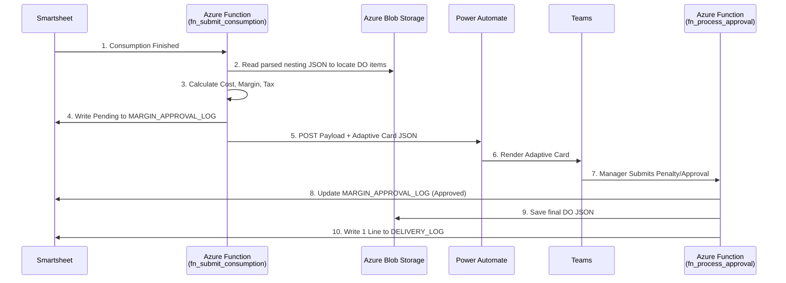

# DO Margin Approval Workflow & Costing Specification

**Purpose:** Authoritative, production-ready specification for implementing the Delivery Order (DO) margin calculation, manager approval routing via Adaptive Cards, and DO item processing.

---

## 1. Executive Summary

After consumption logging is complete for a Tag Sheet, the system deterministically calculates the Gross Margin, taking into account specific material costs and fixed manufacturing costs (with a 1% credit risk buffer). A Power Automate webhook triggers an Adaptive Card sent to the Production Manager, displaying these costs, corporate tax implications, and the GM vs Target Margin variance. The manager can approve or append an area penalty. Upon approval, a single DO line is recorded in `DELIVERY_LOG`, and the detailed DO item JSON is saved to Azure Blob Storage alongside the original nesting files.

---

## 2. Design Principles (Non-Negotiable)

1. **Separation of Concerns:** Smartsheet stores state; Azure Functions compute math. No formulas in Smartsheet.
2. **Idempotency:** Webhooks acting on approvals must use `client_request_id` to prevent duplicate DO generation.
3. **Blob-Driven Detail:** `DELIVERY_LOG` only gets **one line per DO**. The granular JSON of pieces delivered is stored in Azure Blob Storage.
4. **Deterministic Costing:** Costs are strictly defined. Fallbacks rely on `CONFIG`.
5. **Fail-Fast & Audit:** Missing critical data triggers `EXCEPTION_LOG`. Valid user approvals trigger `USER_ACTION_LOG`.

---

## 3. Costing & Margin Logic Specification

### 3.1 Constants and Inputs

**Fixed Setup Costs (AED per SQM Delivered):**
* Executive Labor: **1.00**
* Floor Staff: **6.00**
* Delivery: **1.00**
* Depreciation of Machine: **0.27**
* Utility Charges: **0.10**
* Warehouse Rent: **0.50**
* Scrap Collection: **0.20**
* Finance Charges: **0.45**
* Additional Warranty / Acceptance / Witness / Installation / DLP / AMC: **0.00**

**Subtotal Fixed Costs** = **9.52 AED / SQM**

### 3.2 Dynamic Inputs

1. `Delivered_SQM`: From the Tag Sheet `PRODUCTION_LOG` or `TAG_REGISTRY`.
2. `Material_Costs_AED`: Derived by summing the `CONSUMPTION_LOG` mapped costs for this tag. If specific cost is missing, read default from `CONFIG`.
3. `Selling_Price_Per_SQM`: From `LPO_MASTER.PRICE_PER_SQM` for this LPO.
4. `Target_Margin_Pct`: From `LPO_MASTER` or defaults to **12% (0.12)** from `CONFIG`.

### 3.3 Calculation Formula (Deterministic)

*Note: Calculations happen at the total Tag Sheet level or per SQM level. Provided logic applies per Tag Sheet.*

1. **Total Material Cost:** `Sum of all actual consumed materials (AED)`
2. **Total Fixed Cost:** `9.52 * Delivered_SQM`
3. **Pre-Risk Cost:** `Total Material Cost + Total Fixed Cost`
4. **Credit Risk (1%):** `Pre-Risk Cost * 0.01`
5. **Total Cost:** `Pre-Risk Cost + Credit Risk`
6. **Total Revenue:** `Delivered_SQM * Selling_Price_Per_SQM`
7. **Gross Profit:** `Total Revenue - Total Cost`
8. **Gross Margin (GM) %:** `Gross Profit / Total Revenue`
9. **Corporate Tax (9%):** `Gross Profit * 0.09` (Calculated for display, assuming UAE standard. Only applies if Profit > 0).
10. **Target Revenue:** `Total Cost / (1 - Target_Margin_Pct)`
11. **Required Billing Area:** `Target Revenue / Selling_Price_Per_SQM`
12. **Required Area Variation %:** `(Required Billing Area / Delivered_SQM) - 1` (This is the % to show the manager to reach the target margin).
    *(e.g., if Delivered is 100 SQM, and Required is 112 SQM to hit margin, Variation % is 12%).*



---

## 5. Data Model (Smartsheet & Blob)

### 5.1 `MARGIN_APPROVAL_LOG` (Smartsheet Phase 1)

* `APPROVAL_ID` (Text/Number, Primary) - Deterministic UUID.
* `TAG_SHEET_ID` (Text/Number)
* `LPO_ID` (Text/Number)
* `MATERIAL_COST_AED` (Text/Number)
* `OTHER_COSTS_AED` (Text/Number) - Including 1% risk.
* `GM_EXC_TAX_PCT` (Text/Number) - The calculated baseline GM %.
* `CORP_TAX_AED` (Text/Number)
* `TARGET_MARGIN_VARIANCE_PCT` (Text/Number)
* `MANAGER_PENALTY_PCT` (Text/Number) - Input from the Adaptive Card.
* `STATUS` (Picklist: Pending, Approved, Rejected)
* `CLIENT_REQUEST_ID` (Text/Number) - Used for idempotency lock.

### 5.2 Delivery Artifacts (Blob Storage & Smartsheet)

**`DELIVERY_LOG` (Smartsheet):** Add exactly **ONE** row per DO.
* `DELIVERY_ID`: New generated deterministic ID.
* `TAG_SHEET_ID`: Sourced Tag.
* `SAP_DO_NUMBER`: Pending SAP.
* `LINES`: `1` (Representing the bundle).
* `QUANTITY`: `Delivered_SQM` (Adjusted by the Manager's Penalty %).

**Azure Blob Storage (`/LPOs/LPO_<id>/Deliveries/do_<uuid>.json`):**
Contains the JSON schema representing the physical pieces being delivered. Sourced from the parsed `nesting.json` combined with the dynamic percentage changes.

---

## 6. Adaptive Card Specification

The Adaptive Card strictly complies with schema v1.4.

* **Body:**
  * **FactSet (Read Only):**
    * Material Costs (AED)
    * Other Costs (AED) (Fixed + Risk)
    * Corporate Tax (AED)
    * GM Exclusive of Corp Tax (%)
    * Target Margin Variance (%)
    * Selling Price (AED/Sqm - Fixed from LPO)
  * **Input.Number:** `id="manager_penalty"` (Title: "Apply Area Variance Penalty % to reach Target Margin").
  * **Input.ChoiceSet:** `id="merge_tags"`, multiple selection. Lists all Tag Sheets where `Status = 'Production Complete'` AND `LPO_ID` matches current LPO.
* **Actions:**
  * `Action.Submit` (Proceed to DO)
  * `Action.Submit` (Wait / Hold)

---

## 7. API Contracts (Developer Reference)

### `fn_margin_trigger` (Internal Call or Trigger)
Called at the very end of `fn_submit_consumption` when a tag is 100% consumed.
**Returns to Caller:** Adaptive Card JSON string.
*(Note: As per requirements, the function MUST return the generated Card payload).*

### `POST /api/margin/approve` (Webhook for Teams)
**Payload:**
```json
{
  "client_request_id": "guid-from-teams",
  "approval_id": "smartsheet-margin-row-id",
  "manager_penalty_pct": 5.0,
  "merge_tags": "TAG2,TAG3",
  "decision": "PROCEED"
}
```
**Actions:**
1. Check Idempotency (`client_request_id` not processed).
2. Apply `manager_penalty_pct` multiplier to `Delivered_SQM`.
3. Update `MARGIN_APPROVAL_LOG` to `Approved`.
4. Generate `do_<uuid>.json` containing pieces from all merged tags. Upload to Blob.
5. Create **ONE** row in `DELIVERY_LOG`.
6. Update affected Tags in `TAG_REGISTRY` to `DO Generated`.
