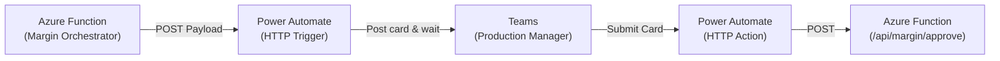

# Power Automate: DO Margin Approval Flow

This document specifies the exact Power Automate flow configuration required to handle the Delivery Order (DO) Margin Approval process.

As per SOTA architecture, **Power Automate contains zero business logic**. It simply receives a pre-built Adaptive Card from the Azure Function, shows it to the Production Manager, and forwards their response back to the Azure Webhook.

---

## Architecture Overview



---

## The Flow: 3 Simple Actions

### Action 1: Trigger (When an HTTP request is received)

**Purpose:** Receives the Adaptive Card JSON directly from the Margin Orchestrator (`fn_submit_consumption`).

**Configuration:**
1. Generate the HTTP POST URL and copy it. 
2. Add this URL to Smartsheet `CONFIG` sheet under the key `POWER_AUTOMATE_MANAGER_APPROVAL_URL` (or as an Environment Variable in Azure).
3. **JSON Schema:**
```json
{
    "type": "object",
    "properties": {
        "card_json": {
            "type": "object"
        },
        "approval_id": {
            "type": "string"
        },
        "tag_sheet_id": {
            "type": "string"
        },
        "lpo": {
            "type": "string"
        },
        "trace_id": {
            "type": "string"
        }
    }
}
```

---

### Action 2: Post Adaptive Card to Teams

**Purpose:** Forward the raw JSON card to the Production Manager and wait for them to click "Proceed to DO" or "Hold".

**Configuration:**
| Field | Value |
|-------|-------|
| **Action** | `Post adaptive card and wait for a response` |
| **Post as** | `Flow bot` |
| **Post in** | `Chat with Flow bot` (or Channel, depending on preference) |
| **Recipient** | Production Manager's Email/UPN |
| **Adaptive Card** | `@triggerBody()?['card_json']` |

*Note: You do not need to build the card in Power Automate! The Azure Function has already formatted the taxes, margins, variance percentages, and Dropdowns into `card_json`.*

---

### Action 3: Send Response to Azure Webhook

**Purpose:** Forward the Manager's input (penalty % and merged tags) to the processing engine.

**Configuration:**
| Field | Value |
|-------|-------|
| **Action** | `HTTP` |
| **Method** | `POST` |
| **URI** | `https://<your-azure-app>.azurewebsites.net/api/fn_process_manager_approval` |
| **Headers** | `Content-Type: application/json` |

**Body Generation:**
The Adaptive Card automatically returns the Manager's submitted values through Teams. We wrap this into a clean JSON for Azure:

```json
{
  "client_request_id": "@{guid()}",
  "approval_row_id": "@{triggerBody()?['approval_id']}",
  "tag_sheet_id": "@{triggerBody()?['tag_sheet_id']}",
  "action": "@{body('Post_adaptive_card_and_wait_for_a_response')?['submitActionId']}",
  "manager_penalty_pct": "@{body('Post_adaptive_card_and_wait_for_a_response')?['data']?['manager_penalty_pct']}",
  "merge_tags": "@{body('Post_adaptive_card_and_wait_for_a_response')?['data']?['merge_tags']}"
}
```

*(Note: The `action` field maps either to `proceed_to_do` or `hold_tag` based on which button the Manager clicked).*

---

### Conclusion

This strict 3-step setup ensures idempotency (`client_request_id`) and prevents Power Automate from needing to do complex math or JSON manipulation, keeping the truth rooted securely in Python.
