# 🏗️ Architecture Overview

> **Document Type:** Explanation | **Audience:** All Team Members | **Last Updated:** 2026-01-08

This document provides a high-level understanding of the Ducts Manufacturing Inventory Management System architecture. For detailed specifications, see the [Architecture Specification](../Specifications/architecture_specification.md).

---

## Table of Contents

1. [System Purpose](#system-purpose)
2. [Architecture Principles](#architecture-principles)
3. [Component Overview](#component-overview)
4. [Data Flow](#data-flow)
5. [Technology Stack](#technology-stack)
6. [Key Concepts](#key-concepts)
7. [Security Architecture](#security-architecture)
8. [Migration Strategy](#migration-strategy)

---

## System Purpose

The Ducts Manufacturing Inventory Management System provides:

| Capability | Description |
|------------|-------------|
| **Tag-based Production Planning** | T-1 nesting workflow for production scheduling |
| **Ledger-first Inventory Control** | Allocation → Pick → Consumption → Dispatch lifecycle |
| **Exception-driven Operations** | Full audit trail with SLA tracking |
| **SAP Integration Readiness** | Designed as peer system, not master |

### Business Value

```
📊 Before                          📊 After
------                             -----
❌ Manual tracking                 ✅ Automated workflows
❌ Excel spreadsheets              ✅ Centralized data
❌ Inventory discrepancies         ✅ Real-time reconciliation
❌ No audit trail                  ✅ Complete traceability
```

---

## Architecture Principles

### 1. Separation of Concerns

```mermaid
flowchart TB
    subgraph Presentation["📊 Presentation Layer"]
        SS[Smartsheet]
    end
    subgraph Orchestration["⚡ Orchestration Layer"]
        PA[Power Automate]
    end
    subgraph Logic["☁️ Business Logic Layer"]
        AF[Azure Functions]
    end
    
    SS -->|Forms & Views| PA
    PA -->|Event Routing| AF
    AF -->|All Logic & Validation| DB[(Data Store)]
    
    style SS fill:#4CAF50,color:#fff
    style PA fill:#2196F3,color:#fff
    style AF fill:#FF9800,color:#fff
```



**Key Rule:** No business logic in Smartsheet formulas or Power Automate. All deterministic logic lives in Azure Functions.

### 2. Ledger-First Design

Every operation creates an immutable transaction record:

```mermaid
flowchart LR
    subgraph Bad["❌ Bad Pattern"]
        U1[UPDATE] --> T1["qty = 100"]
    end
    subgraph Good["✅ Good Pattern"]
        I1[INSERT] --> T2["type='ISSUE', qty=-5"]
    end
```



### 3. Idempotency Everywhere

Every API call can be safely retried:


### 4. Exception as First-Class Citizens

Errors don't fail silently—they create trackable exception records:

```mermaid
flowchart LR
    A["❌ Validation\nFailure"] --> B["📝 Exception\nCreated"]
    B --> C["📧 Notification\nSent"]
    B --> D["📊 Dashboard\nUpdated"]
    
    style A fill:#f44336,color:#fff
    style B fill:#FF9800,color:#fff
    style C fill:#4CAF50,color:#fff
    style D fill:#2196F3,color:#fff
```



---

## Component Overview

### High-Level Architecture

```mermaid
flowchart TB
    subgraph UI["🖥️ USER INTERFACE"]
        SS[📊 Smartsheet<br/>Forms/Sheets]
        PBI[📈 Power BI<br/>Dashboards]
        Teams[💬 Teams<br/>Notifications]
    end
    
    subgraph Orch["⚡ ORCHESTRATION LAYER"]
        PA[Power Automate]
        TRG["TRG_* Triggers"]
        WRK["WRK_* Workers"]
        UTL["UTL_* Utilities"]
    end
    
    subgraph Compute["☁️ COMPUTE LAYER"]
        subgraph Functions[Azure Functions]
            FN1[fn_ingest_tag]
            FN2[fn_parse_nest]
            FN3[fn_allocate]
            FN4[fn_pick_confm]
            FN5[fn_consume]
            FN6[fn_create_do]
        end
        Shared[📦 Shared Library<br/>models • client • helpers]
    end
    
    subgraph Data["🗄️ DATA LAYER"]
        SSData[(Smartsheet<br/>Data Store)]
        SP[(SharePoint<br/>File Store)]
        SAP[(SAP<br/>Integration)]
    end
    
    UI --> Orch
    Orch --> Compute
    Compute --> Data
    
    style UI fill:#E3F2FD
    style Orch fill:#FFF3E0
    style Compute fill:#E8F5E9
    style Data fill:#FCE4EC
```



### Component Responsibilities

| Component | Responsibilities | Anti-Patterns |
|-----------|-----------------|---------------|
| **Smartsheet** | UI, Forms, Data Display | ❌ No formulas for business logic |
| **Power Automate** | Event routing, Notifications, Retries | ❌ No calculations or decisions |
| **Azure Functions** | All logic, Validation, ID generation | ✅ Stateless, Idempotent |
| **SharePoint** | File storage, Version history | Immutable file store |
| **SAP** | ERP integration (peer system) | ❌ Not treated as source of truth |

---

## Data Flow

### Tag Ingestion Flow

```mermaid
sequenceDiagram
    participant U as 👤 User
    participant S as 📊 Smartsheet
    participant P as ⚡ Power Automate
    participant F as ☁️ fn_ingest_tag
    participant DB as 🗄️ Data Store
    
    U->>S: Upload Tag Sheet
    S->>P: Trigger Flow
    P->>F: POST /api/tags/ingest
    
    rect rgb(240, 248, 255)
        Note over F: Processing Steps
        F->>F: 1. Parse & Validate
        F->>DB: 2. Idempotency Check
        F->>DB: 3. File Hash Check
        F->>DB: 4. LPO Validation
        F->>F: 5. Generate Tag ID
        F->>DB: 6. Create Tag Record
        F->>DB: 7. Log User Action
    end
    
    alt Success
        F-->>P: 200 OK (UPLOADED)
        P->>S: Update Status ✅
    else Validation Error
        F-->>P: 422 (BLOCKED)
        F->>DB: Create Exception
        P->>S: Update Status ❌
    end
```



### Complete Production Lifecycle

```mermaid
flowchart LR
    subgraph Planning["📋 Planning Phase"]
        A[📤 Tag Upload] --> B[✅ Release]
        B --> C[🔧 Nesting]
    end
    
    subgraph Execution["⚙️ Execution Phase"]
        C --> D[📦 Allocation]
        D --> E[✋ Pick Confirm]
        E --> F[🏭 Consumption]
    end
    
    subgraph Delivery["🚚 Delivery Phase"]
        F --> G[📋 Dispatch]
        G --> H[📄 DO Generate]
        H --> I[📸 POD Upload]
        I --> J[💰 Invoice]
    end
    
    style A fill:#4CAF50,color:#fff
    style J fill:#2196F3,color:#fff
```



---

## Technology Stack

### Backend

| Technology | Purpose | Version |
|------------|---------|---------|
| Python | Primary language | 3.9+ |
| Azure Functions | Serverless compute | v4 |
| Pydantic | Data validation | 2.x |
| Requests | HTTP client | Latest |

### Storage

| Technology | Purpose | Usage |
|------------|---------|-------|
| Smartsheet | Data store (prototype) | All sheets |
| SharePoint | File storage | PDFs, exports |
| Azure SQL | Future data store | Migration target |

### Orchestration

| Technology | Purpose | Usage |
|------------|---------|-------|
| Power Automate | Workflow orchestration | All flows |
| Azure Event Grid | Event routing | Future |

### Monitoring

| Technology | Purpose | Usage |
|------------|---------|-------|
| Azure App Insights | Telemetry, Logging | All functions |
| Power BI | Dashboards | KPIs, Reporting |

---

## Key Concepts

### ID-First Architecture

To ensure robustness against renaming and structure changes in Smartsheet, the system uses an **ID-First Architecture**.

1.  **Immutable IDs**: The system relies on Smartsheet's immutable alphanumeric IDs (e.g., `sheet_id`, `column_id`) rather than names.
2.  **Workspace Manifest**: A `workspace_manifest.json` file maps logical names (used in code) to these physical IDs.
3.  **Logical Names**: The code uses constant Logical Names (e.g., `Sheet.TAG_REGISTRY`, `Column.TAG_REGISTRY.FILE_HASH`) defined in `shared.logical_names`.
4.  **Decoupling**: This decouples the application code from the user-facing Smartsheet interface, allowing users to rename sheets or columns without breaking integrations.

```mermaid
flowchart LR
    Code["💻 Application Code<br/>(Logical Names)"]
    Manifest["📜 Manifest<br/>(Mapping)"]
    Smartsheet["📊 Smartsheet API<br/>(Physical IDs)"]
    
    Code -->|Sheet.TAG_REGISTRY| Manifest
    Manifest -->|ID: 457812...| Smartsheet
```



### ID Generation Strategy

IDs are generated server-side using sequence counters stored in the Config sheet:

| Entity | Format | Example |
|--------|--------|---------|
| Tag | `TAG-NNNN` | TAG-0001 |
| Exception | `EX-NNNN` | EX-0042 |
| Allocation | `ALLOC-NNNN` | ALLOC-0123 |
| Delivery Order | `DO-NNNN` | DO-0015 |

**Why sequential IDs?**
- Human-readable and easy to communicate
- Immutable (never reused)
- Migration-ready (same pattern works with SQL sequences)

### Idempotency Pattern

```python
# Every request includes a client_request_id
request = {
    "client_request_id": "unique-uuid-here",  # Caller generates
    "lpo_sap_reference": "SAP-001",
    # ... other fields
}

# Function checks for existing request
existing = find_by_client_request_id(request.client_request_id)
if existing:
    return existing_response  # No duplicate processing
```

### Exception Lifecycle


Each exception has:
- **SLA Due**: Automatically calculated based on severity
- **Assigned To**: Role-based routing
- **Attachments**: Evidence and documentation
- **Resolution Action**: Outcome and notes

---

## Security Architecture

### Authentication Flow

```mermaid
sequenceDiagram
    participant U as 👤 User/Service
    participant AD as 🔐 Azure AD
    participant F as ☁️ Azure Function
    participant KV as 🔑 Key Vault
    
    U->>AD: Request Token
    AD-->>U: JWT Token
    U->>F: API Call + Bearer Token
    F->>AD: Validate Token
    AD-->>F: Token Valid ✅
    F->>KV: Get Secrets
    KV-->>F: API Keys
    F-->>U: Response
```



### Secret Management

| Secret | Storage Location | Access Method |
|--------|-----------------|---------------|
| API Keys | Azure Key Vault | Managed Identity |
| Connection Strings | App Settings | Environment Variables |
| Local Dev Secrets | local.settings.json | Local only (gitignored) |

### RBAC Roles

| Role | Permissions |
|------|-------------|
| Production Manager | Release tags, Approve overrides |
| Supervisor | Upload nesting files |
| Storekeeper | Pick confirm, Cycle counts |
| Logistics | DO build, POD upload |
| Finance | Invoice approvals |

---

## Migration Strategy

The system is designed for **zero-friction migration** to Azure SQL/Dataverse:


### Migration Guarantees

| Aspect | Guarantee |
|--------|-----------|
| Column Names | Identical across Smartsheet → SQL |
| Data Types | Compatible with SQL schemas |
| Logic Location | All in Power Automate/Functions (portable) |
| Ledger Pattern | Append-only (simple data export) |

---

## Related Documentation

| Document | Description |
|----------|-------------|
| [Architecture Specification](../Specifications/architecture_specification.md) | Detailed architecture |
| [Data Dictionary](./reference/data_dictionary.md) | Complete data models |
| [API Reference](./reference/api_reference.md) | API documentation |
| [Flow Architecture](../Specifications/flow_architecture.md) | Power Automate flows |

---

<p align="center">
  <a href="./reference/api_reference.md">📘 API Reference →</a>
</p>
