# 🚀 Deployment Guide

> **Document Type:** How-To | **Audience:** Developers, DevOps | **Last Updated:** 2026-01-08

This guide covers deploying the Ducts Manufacturing Inventory Management System to Azure.

---

## Table of Contents

1. [Deployment Overview](#deployment-overview)
2. [Environment Setup](#environment-setup)
3. [Deployment Methods](#deployment-methods)
4. [Configuration Management](#configuration-management)
5. [Post-Deployment Verification](#post-deployment-verification)
6. [Rollback Procedures](#rollback-procedures)

---

## Deployment Overview

### Environments

| Environment | Purpose | URL Pattern |
|-------------|---------|-------------|
| DEV | Development testing | `dev-fn-ducts.azurewebsites.net` |
| UAT | User acceptance testing | `uat-fn-ducts.azurewebsites.net` |
| PROD | Production | `prod-fn-ducts.azurewebsites.net` |

### Deployment Flow

```mermaid
flowchart LR
    subgraph Local["💻 Local"]
        L[func start]
    end
    
    subgraph Dev["🔧 DEV"]
        D[Auto-deploy<br/>on push]
    end
    
    subgraph UAT["🧪 UAT"]
        U[Manual gate<br/>testing]
    end
    
    subgraph Prod["🚀 PROD"]
        P[Approval<br/>required]
    end
    
    L -->|git push| D
    D -->|Tests pass| U
    U -->|Approved| P
    
    style Local fill:#E3F2FD
    style Dev fill:#FFF3E0
    style UAT fill:#E8F5E9
    style Prod fill:#FCE4EC
```



### CI/CD Pipeline

```mermaid
flowchart TD
    A[📝 Code Push] --> B[🔍 Linting]
    B --> C[🧪 Unit Tests]
    C --> D[🔗 Integration Tests]
    D --> E{Tests Pass?}
    
    E -->|Yes| F[📦 Build Package]
    E -->|No| G[❌ Notify & Stop]
    
    F --> H[🚀 Deploy to DEV]
    H --> I[✅ Smoke Tests]
    I --> J{Env?}
    
    J -->|UAT| K[👤 Manual Approval]
    J -->|PROD| L[👥 Multi-Approval]
    
    K --> M[🚀 Deploy to UAT]
    L --> N[🚀 Deploy to PROD]
    
    style A fill:#2196F3,color:#fff
    style N fill:#4CAF50,color:#fff
    style G fill:#f44336,color:#fff
```



---

## Environment Setup

### Azure Resources Required

| Resource | Purpose | Per Environment |
|----------|---------|-----------------|
| Function App | Hosts functions | Yes |
| App Service Plan | Compute resources | Shared or dedicated |
| Storage Account | Function storage | Yes |
| Key Vault | Secret management | Shared |
| App Insights | Monitoring | Yes |

### Creating a Function App

#### Azure Portal

1. Navigate to **Create a resource** → **Function App**
2. Configure:
   - **Runtime stack:** Python 3.9+
   - **Hosting:** Consumption (Serverless) or Premium
   - **Region:** Same as your users/data
3. Enable **Application Insights**
4. Create

#### Azure CLI

```bash
# Create resource group
az group create --name rg-ducts-prod --location uaenorth

# Create storage account
az storage account create \
  --name stductsprodfunc \
  --resource-group rg-ducts-prod \
  --sku Standard_LRS

# Create function app
az functionapp create \
  --name prod-fn-ducts \
  --resource-group rg-ducts-prod \
  --storage-account stductsprodfunc \
  --consumption-plan-location uaenorth \
  --runtime python \
  --runtime-version 3.9 \
  --functions-version 4 \
  --os-type linux
```

---

## Deployment Methods

### Method 1: VS Code (Recommended for Development)

1. Install **Azure Functions** extension
2. Right-click `functions` folder → **Deploy to Function App**
3. Select target Function App
4. Confirm deployment

### Method 2: Azure CLI

```bash
cd functions

# Deploy
func azure functionapp publish prod-fn-ducts

# Deploy with additional options
func azure functionapp publish prod-fn-ducts --python
```

### Method 3: GitHub Actions (CI/CD)

Create `.github/workflows/deploy.yml`:

```yaml
name: Deploy to Azure Functions

on:
  push:
    branches:
      - main    # DEV
      - uat     # UAT
      - prod    # PROD (requires approval)

jobs:
  build-and-deploy:
    runs-on: ubuntu-latest
    
    steps:
    - name: Checkout
      uses: actions/checkout@v3
    
    - name: Setup Python
      uses: actions/setup-python@v4
      with:
        python-version: '3.9'
    
    - name: Install dependencies
      run: |
        cd functions
        pip install -r requirements.txt
    
    - name: Run tests
      run: |
        cd functions
        pip install pytest pytest-cov
        pytest -m "not slow"
    
    - name: Deploy to Azure
      uses: Azure/functions-action@v1
      with:
        app-name: ${{ env.AZURE_FUNCTIONAPP_NAME }}
        package: functions
        publish-profile: ${{ secrets.AZURE_FUNCTIONAPP_PUBLISH_PROFILE }}
```

### Method 4: Azure DevOps Pipeline

```yaml
trigger:
  - main

pool:
  vmImage: 'ubuntu-latest'

steps:
- task: UsePythonVersion@0
  inputs:
    versionSpec: '3.9'

- script: |
    cd functions
    pip install -r requirements.txt
  displayName: 'Install dependencies'

- script: |
    cd functions
    pytest
  displayName: 'Run tests'

- task: ArchiveFiles@2
  inputs:
    rootFolderOrFile: 'functions'
    includeRootFolder: false
    archiveFile: '$(Build.ArtifactStagingDirectory)/functions.zip'

- task: AzureFunctionApp@1
  inputs:
    azureSubscription: 'your-subscription'
    appType: 'functionAppLinux'
    appName: 'prod-fn-ducts'
    package: '$(Build.ArtifactStagingDirectory)/functions.zip'
    runtimeStack: 'PYTHON|3.9'
```

---

## Configuration Management

### Application Settings

Set in Azure Portal → Function App → Configuration → Application Settings:

| Setting | Description | Example |
|---------|-------------|---------|
| `SMARTSHEET_API_KEY` | API key (from Key Vault) | `@Microsoft.KeyVault(...)` |
| `SMARTSHEET_WORKSPACE_ID` | Workspace ID | `1234567890123456` |
| `SMARTSHEET_BASE_URL` | API endpoint | `https://api.smartsheet.eu/2.0` |

### Using Key Vault

1. Create Key Vault secret:
   ```bash
   az keyvault secret set \
     --vault-name kv-ducts-prod \
     --name SmartsheetApiKey \
     --value "your-api-key"
   ```

2. Grant Function App access:
   ```bash
   az webapp identity assign --name prod-fn-ducts --resource-group rg-ducts-prod
   
   az keyvault set-policy \
     --name kv-ducts-prod \
     --object-id <function-app-identity> \
     --secret-permissions get
   ```

3. Reference in App Settings:
   ```
   SMARTSHEET_API_KEY=@Microsoft.KeyVault(VaultName=kv-ducts-prod;SecretName=SmartsheetApiKey)
   ```

### Environment-Specific Configuration

| Setting | DEV | UAT | PROD |
|---------|-----|-----|------|
| `LOG_LEVEL` | DEBUG | INFO | WARNING |
| `WORKSPACE_ID` | dev-workspace | uat-workspace | prod-workspace |
| Rate limits | Relaxed | Standard | Standard |

---

## Post-Deployment Verification

### Health Check

```bash
# Check function is accessible
curl https://prod-fn-ducts.azurewebsites.net/api/health

# Test endpoint
curl -X POST https://prod-fn-ducts.azurewebsites.net/api/tags/ingest \
  -H "x-functions-key: YOUR_KEY" \
  -H "Content-Type: application/json" \
  -d '{"lpo_sap_reference": "TEST-001", ...}'
```

### Verify Logs

1. Azure Portal → Function App → Log Stream
2. Or: Application Insights → Logs
   ```kusto
   traces
   | where timestamp > ago(1h)
   | where message contains "fn_ingest_tag"
   | order by timestamp desc
   ```

### Smoke Tests

```bash
# Run smoke test suite
pytest tests/e2e/test_smoke.py --env=prod
```

---

## Rollback Procedures

### Immediate Rollback (Deployment Slots)

If using deployment slots:

```bash
# Swap back to previous version
az functionapp deployment slot swap \
  --name prod-fn-ducts \
  --resource-group rg-ducts-prod \
  --slot staging \
  --target-slot production
```

### Revert to Previous Deployment

```bash
# List recent deployments
az functionapp deployment list \
  --name prod-fn-ducts \
  --resource-group rg-ducts-prod

# Trigger redeployment from specific commit
git checkout <previous-commit>
func azure functionapp publish prod-fn-ducts
```

### Emergency Disable

```bash
# Disable function
az functionapp config appsettings set \
  --name prod-fn-ducts \
  --resource-group rg-ducts-prod \
  --settings AzureWebJobs.fn_ingest_tag.Disabled=true
```

---

## Deployment Checklist

### Pre-Deployment

- [ ] All tests passing locally
- [ ] Code reviewed and approved
- [ ] Version/changelog updated
- [ ] Configuration prepared for target environment
- [ ] Stakeholders notified

### Deployment

- [ ] Deploy to target environment
- [ ] Verify deployment success in Azure Portal
- [ ] Check function logs for errors
- [ ] Run health check

### Post-Deployment

- [ ] Run smoke tests
- [ ] Verify API responses
- [ ] Check Application Insights
- [ ] Monitor for 30 minutes
- [ ] Update status/stakeholders

### Rollback Criteria

Rollback if any of:
- [ ] Health check fails
- [ ] Error rate > 1%
- [ ] Response time > 5 seconds
- [ ] Critical business function broken

---

## Related Documentation

| Document | Description |
|----------|-------------|
| [Setup Guide](../setup_guide.md) | Local environment |
| [Configuration Reference](../reference/configuration.md) | Config options |
| [Troubleshooting](./troubleshooting.md) | Deployment issues |

---

<p align="center">
  <a href="../CONTRIBUTING.md">🤝 Contributing Guide →</a>
</p>
