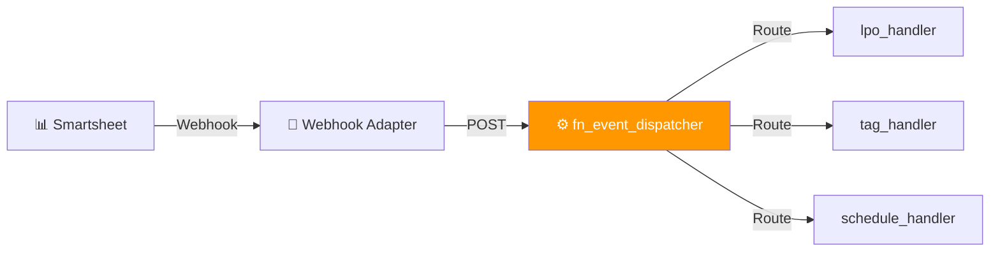

[Home](../../index.md) > [API Reference](./index.md) > Event Dispatcher

# Event Dispatcher API

> **Endpoint:** `POST /api/events/process-row` | **Version:** 1.4.0+ | **Last Updated:** 2026-02-06

Central event router that receives Smartsheet webhook events and dispatches to appropriate handlers based on ID-based routing configuration.

---

## Architecture



**Key Features:**
- ✅ **Externalized Routing**: Routes defined in `event_routing.json` (no code changes)
- ✅ **ID-Based Routing**: Uses immutable sheet IDs (not names)
- ✅ **Handler Registry**: Modular handler architecture
- ✅ **Status Tracking**: OK, IGNORED, NOT_IMPLEMENTED, ERROR

---

## Request Schema

### Endpoint

```http
POST /api/events/process-row
Content-Type: application/json
x-trace-id: trace-abc123 (optional)
```

### Request Body

```json
{
  "sheet_id": 123456789012345,
  "row_id": 987654321098765,
  "action": "created",
  "timestamp": "2026-01-20T12:00:00Z"
}
```

### Request Fields

| Field | Type | Required | Description |
|-------|------|----------|-------------|
| `sheet_id` | integer | Yes | Smartsheet sheet ID (immutable) |
| `row_id` | integer | Yes | Row ID that triggered the event |
| `action` | string | Yes | Event action: `created`, `updated`, `deleted` |
| `timestamp` | string | No | ISO 8601 timestamp of event |

---

## Response Schemas

### Processed (200 OK)

Event successfully routed and processed by handler.

```json
{
  "status": "OK",
  "handler": "lpo_handler",
  "result": {
    "lpo_id": "LPO-0024",
    "sap_reference": "PTE-185"
  },
  "trace_id": "trace-abc123def456",
  "processing_time_ms": 125.5
}
```

### Ignored (200 OK)

No route configured for this sheet/action combination.

```json
{
  "status": "IGNORED",
  "message": "No route configured for this event",
  "trace_id": "trace-abc123def456",
  "processing_time_ms": 5.2
}
```

### Not Implemented (200 OK)

Handler exists in config but not yet implemented in code.

```json
{
  "status": "NOT_IMPLEMENTED",
  "handler": "lpo_status_change",
  "message": "Handler 'lpo_status_change' is not yet implemented",
  "trace_id": "trace-abc123def456",
  "processing_time_ms": 3.1
}
```

### Handler Error (200 OK)

Handler encountered an error during processing (exception created).

```json
{
  "status": "ERROR",
  "handler": "tag_handler",
  "error_message": "LPO not found",
  "exception_id": "EX-0123",
  "trace_id": "trace-abc123def456",
  "processing_time_ms": 45.3
}
```

---

## Routing Configuration

Routes are defined in `event_routing.json` (externalized):

```json
{
  "routes": [
    {
      "logical_sheet": "LPO_INGESTION_STAGING",
      "description": "01h LPO Ingestion Staging",
      "actions": {
        "created": {
          "handler": "lpo_handler",
          "enabled": true
        }
      }
    },
    {
      "logical_sheet": "TAG_INGESTION_STAGING",
      "actions": {
        "created": {
          "handler": "tag_handler",
          "enabled": true
        }
      }
    },
    {
      "logical_sheet": "PRODUCTION_PLANNING_STAGING",
      "actions": {
        "created": {
          "handler": "schedule_handler",
          "enabled": true
        }
      }
    }
  ],
  "handler_config": {
    "lpo_handler": {
      "function": "lpo_handler.handle_lpo_ingest",
      "timeout_seconds": 30,
      "retry_on_failure": true
    }
  }
}
```

---

## Handler Architecture

### Available Handlers (v1.6.6)

| Handler | Purpose | Triggers |
|---------|---------|----------|
| `lpo_handler` | LPO ingestion from staging | 01h (LPO_INGESTION_STAGING) |
| `tag_handler` | Tag ingestion from staging | 02h (TAG_INGESTION_STAGING) |
| `schedule_handler` | Production scheduling | 03h (PRODUCTION_PLANNING_STAGING) |

### Handler Interface

All handlers must implement:

```python
async def handle(event: RowEvent, client: SmartsheetClient) -> DispatchResult:
    """
    Process a row event.
    
    Returns:
        DispatchResult with status, handler name, result data
    """
    pass
```

---

## Business Rules

1. **ID-Based Routing**: Uses immutable sheet IDs, not sheet names
2. **Fail-Safe**: Unknown sheets return IGNORED (not ERROR)
3. **Action Filtering**: Only configured actions are processed
4. **Disabled Routes**: Routes can be disabled without code changes
5. **Exception Handling**: Handler errors create exception records with EXCEPTION_LOGGED status (v1.4.2)

---

## Related Documentation

- [Event Routing Configuration](../configuration.md#event-routing) - Config file reference
- [RowEvent Model](../data/models.md#rowevent) - Event data structure
- [Handler Implementations](../data/services.md#event-handlers) - Handler code reference
- [Smartsheet Webhook Setup](../../howto/smartsheet-webhooks.md) - Webhook configuration
