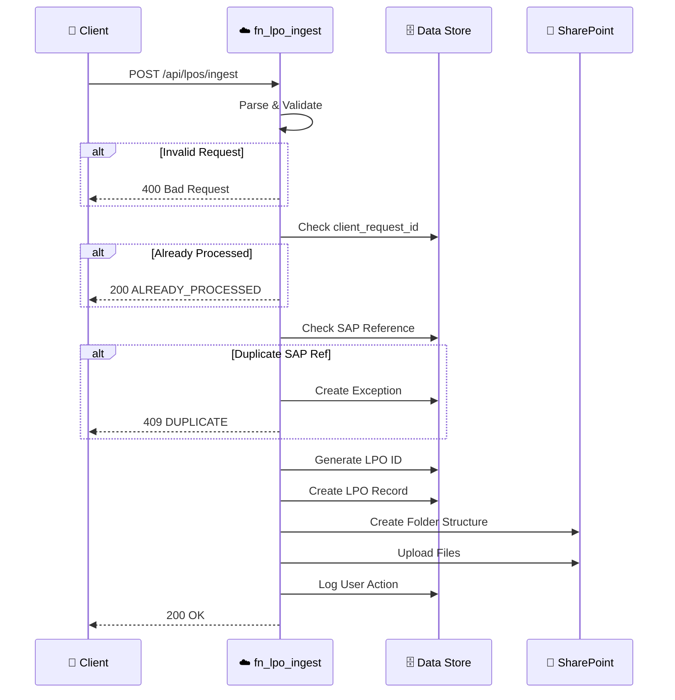

# LPO Ingestion API

> **Endpoint:** `POST /api/lpos/ingest` | **Version:** 1.2.0+ | **Last Updated:** 2026-02-06

Create LPO (Local Purchase Order) records with automatic validation, SharePoint folder generation, and file attachments.

---

## Quick Reference

```bash
curl -X POST "{BASE_URL}/api/lpos/ingest" \
  -H "Content-Type: application/json" \
  -d '{
    "sap_reference": "PTE-185",
    "customer_name": "Acme Utilities",
    "project_name": "Project X",
    "brand": "KIMMCO",
    "po_quantity_sqm": 1250.5,
    "price_per_sqm": 150.00,
    "uploaded_by": "sales@company.com"
  }'
```

---

## Request Flow



---

## Request Schema

### Endpoint

```http
POST /api/lpos/ingest
Content-Type: application/json
```

### Request Body

```json
{
  "client_request_id": "uuid-v4",
  "sap_reference": "PTE-185",
  "customer_name": "Acme Utilities",
  "project_name": "Project X",
  "brand": "KIMMCO",
  "po_quantity_sqm": 1250.5,
  "price_per_sqm": 150.00,
  "customer_lpo_ref": "CUST-LPO-1234",
  "terms_of_payment": "30 Days Credit",
  "wastage_pct": 3.0,
  "area_type": "External",
  "remarks": "Priority delivery",
  "files": [
    {
      "file_type": "lpo",
      "file_url": "https://sharepoint/.../po.pdf",
      "file_name": "PO-185.pdf"
    },
    {
      "file_type": "costing",
      "file_content": "base64-encoded...",
      "file_name": "costing.xlsx"
    }
  ],
  "uploaded_by": "sales@company.com"
}
```

### Request Fields

| Field | Type | Required | Description |
|-------|------|----------|-------------|
| `client_request_id` | string (UUID) | Yes¹ | Idempotency key |
| `sap_reference` | string | Yes | External SAP reference (unique) |
| `customer_name` | string | Yes | Customer name |
| `project_name` | string | Yes | Project name |
| `brand` | string | Yes | Brand: `KIMMCO` or `WTI` |
| `po_quantity_sqm` | number | Yes | PO quantity in sqm (must be > 0) |
| `price_per_sqm` | number | Yes | Price per sqm (must be > 0) |
| `customer_lpo_ref` | string | No | Customer's LPO reference |
| `terms_of_payment` | string | No | Payment terms (default: "30 Days Credit") |
| `wastage_pct` | number | No | Wastage percentage (0-20%) |
| `area_type` | string | No | Internal/External (v1.6.7) |
| `remarks` | string | No | User remarks |
| `files` | array | No | File attachments (multi-file support v1.6.9) |
| `files[].file_type` | string | Yes | Type: `lpo`, `costing`, `amendment`, `other` |
| `files[].file_url` | string | No² | URL to file |
| `files[].file_content` | string | No² | Base64-encoded file content |
| `files[].file_name` | string | No | Original filename |
| `uploaded_by` | string | Yes | User who created the LPO |

> **Notes:**
> - ¹ Auto-generated if not provided
> - ² Either `file_url` or `file_content` is required per file
> - **v1.6.6:** Integrated with LPO Service for centralized validation
> - **v1.6.7:** Added `area_type` field and SharePoint folder creation
> - **v1.6.8:** Auto-generates LPO IDs (LPO-NNNN format)
> - **v1.6.9:** Supports generic file upload flow for SharePoint

---

## Response Schemas

### Success (200 OK)

```json
{
  "status": "OK",
  "lpo_id": "LPO-0024",
  "sap_reference": "PTE-185",
  "folder_url": "https://sharepoint.com/sites/LPO/LPO-0024",
  "trace_id": "trace-abc123def456",
  "message": "LPO created successfully"
}
```

### Duplicate SAP Reference (409 Conflict)

```json
{
  "status": "DUPLICATE",
  "sap_reference": "PTE-185",
  "existing_lpo_id": "LPO-0020",
  "exception_id": "EX-0005",
  "trace_id": "trace-abc123def456",
  "message": "SAP Reference already exists"
}
```

### Validation Error (400 Bad Request)

```json
{
  "status": "ERROR",
  "trace_id": "trace-abc123def456",
  "validation_errors": [
    "po_quantity_sqm must be greater than 0",
    "brand must be either KIMMCO or WTI"
  ],
  "message": "Validation failed"
}
```

---

## Business Rules

1. **Idempotency:** Requests with duplicate `client_request_id` return cached response (v1.6.5)
2. **SAP Reference Uniqueness:** Duplicate SAP references create exception and return 409
3. **Auto-ID Generation (v1.6.8):** Generates `LPO-NNNN` format using `SEQ_LPO` config key
4. **SharePoint Integration (v1.6.7):** 
   - Creates folder structure: `/LPOs/{sap_reference}_{customer_name}/`
   - Subfolders: `01_LPO_Documents`, `02_Costing`, `03_Amendments`, `99_Other`
5. **File Upload (v1.6.9):** Uses generic file upload Power Automate flow
6. **Multi-File Support:** Accepts unlimited file attachments per LPO

---

## Related Documentation

- [LPOIngestRequest Model](../data/models.md#lpoingestrequest) - Complete schema definition
- [LPO Service](../data/services.md#lpo-service) - Centralized LPO operations
- [Generic File Upload Flow](../../flows/generic_file_upload_flow.md) - SharePoint integration
- [LPO Update API](./lpo-ingestion.md#lpo-update) - Update existing LPO records
