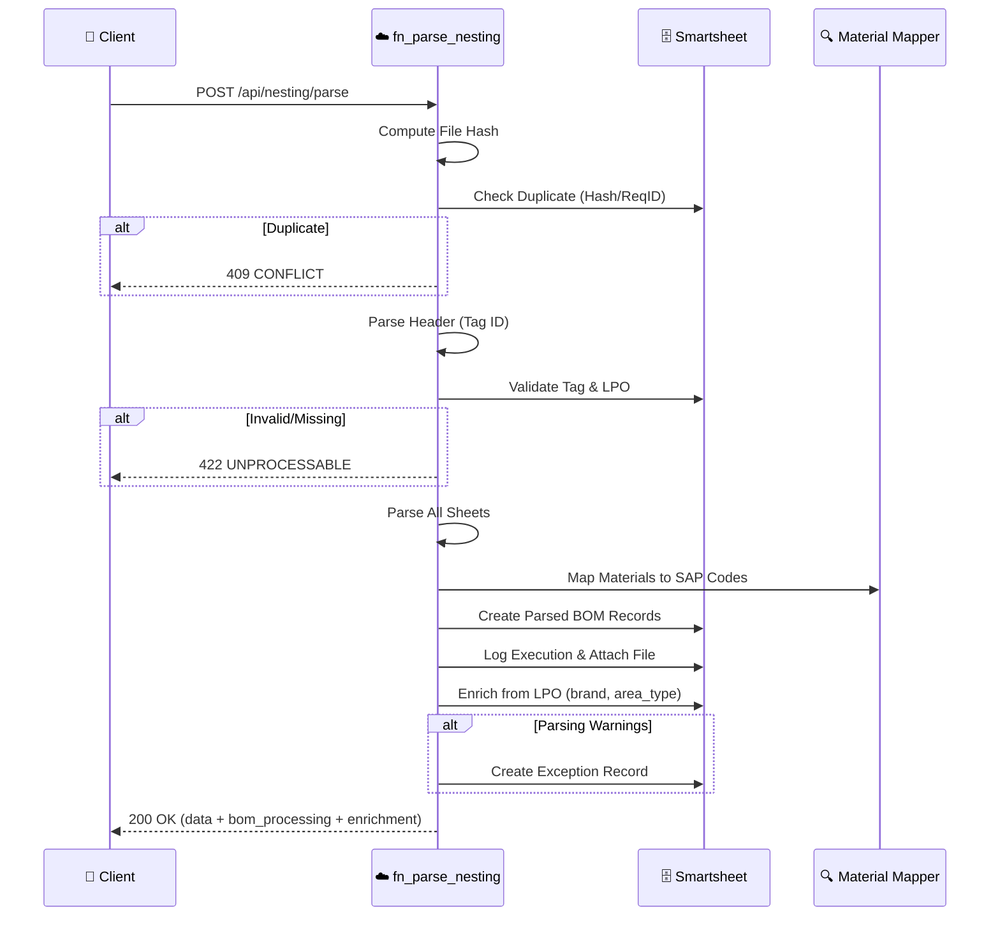

[Home](../../index.md) > [API Reference](./index.md) > Nesting Parser

# Nesting Parser API

> **Endpoint:** `POST /api/nesting/parse` | **Version:** 2.0.0+ | **Last Updated:** 2026-02-06

Parse Eurosoft CutExpert nesting export files and extract structured manufacturing data with automatic BOM generation and enrichment.

---

## Quick Reference

```bash
curl -X POST "{BASE_URL}/api/nesting/parse" \
  -F "file=@TAG-1234_nesting_export.xlsx" \
  -H "x-client-request-id: {UUID}"
```

---

## Key Features (v2.0.0)

- ✅ **Idempotency**: Duplicate uploads (same file hash or client_request_id) are blocked
- ✅ **Fail-Fast**: Validates Tag ID existence and LPO ownership before parsing
- ✅ **Orchestration**: Auto-logs to `NESTING_LOG`, attaches file, creates exceptions for warnings
- ✅ **BOM Generation (v1.6.0)**: Automatic material mapping and BOM creation
- ✅ **Enrichment (v1.6.7)**: Backtracking from LPO for brand, area_type, planned_date

---

## Request Flow



---

## Request Schema

### Endpoint

```http
POST /api/nesting/parse
Content-Type: multipart/form-data
x-client-request-id: <uuid> (optional)
```

### Request Body (Multipart)

```
file: <binary Excel file (.xls/.xlsx)>
```

### Request Body (JSON Alternative)

```json
{
  "file_content": "base64-encoded-excel-content",
  "file_name": "TAG-1234_nesting_export.xlsx",
  "client_request_id": "uuid-v4"
}
```

---

## Parsed Sheets

| Sheet | Data Extracted |
|-------|----------------|
| `Project parameters` | Tag ID, material spec, thickness, inventory impact |
| `Panels info` | Sheet utilization, waste metrics, remnant area |
| `Flanges` | Profile consumption (U, F, H), lengths, remainders |
| `Other components` | Consumables: silicone, tape, glue (with extra %) |
| `Machine info` | Telemetry: cut lengths, travel distance, times |
| `Delivery order` | Finished goods line items, geometry, quantities |

---

## Response Schemas

### Success (200 OK)

Complete parsing with all sheets extracted successfully.

```json
{
  "status": "SUCCESS",
  "tag_id": "TAG-1234",
  "data": {
    "meta_data": {
      "project_ref_id": "TAG-1234",
      "project_name": "Order ABC",
      "validation_status": "OK"
    },
    "raw_material_panel": {
      "material_spec_name": "PIR 25mm",
      "thickness_mm": 25.0,
      "inventory_impact": {
        "utilized_sheets_count": 5,
        "net_reusable_remnant_area_m2": 1.25
      },
      "efficiency_metrics": {
        "nesting_waste_m2": 0.45
      }
    },
    "profiles_and_flanges": [
      {
        "profile_type": "U PROFILE",
        "total_length_m": 45.5,
        "remaining_m": 2.3
      }
    ],
    "consumables": {
      "silicone": {
        "consumption_kg": 0.85,
        "extra_pct": 5.0
      }
    },
    "flange_accessories": {
      "gi_corners_qty": 24,
      "pvc_corners_qty": 16
    },
    "machine_telemetry": {
      "blade_wear_45_m": 15.2,
      "gantry_travel_rapid_m": 156.8
    },
    "delivery_order_items": [
      {
        "line_id": "1",
        "description": "Duct Section A",
        "qty_produced": 10,
        "area_m2": 5.5
      }
    ]
  },
  "bom_processing": {
    "total_lines": 50,
    "mapped_lines": 48,
    "failed_lines": 2,
    "created_bom_ids": ["BOM-1001", "BOM-1002"]
  },
  "enrichment": {
    "brand": "KIMMCO",
    "area_type": "External",
    "planned_date": "2026-02-05",
    "lpo_folder_url": "https://sharepoint.com/sites/LPO/LPO-0024"
  },
  "warnings": [],
  "trace_id": "trace-abc123def456"
}
```

### Partial Success (200 OK)

Some sheets missing or have extraction issues, but core data extracted.

```json
{
  "status": "PARTIAL",
  "tag_id": "TAG-1234",
  "data": { "..." },
  "warnings": [
    "Sheet 'Machine info' not found",
    "Could not extract 'flange_accessories'"
  ],
  "trace_id": "trace-abc123def456"
}
```

### Parsing Error (200 OK)

Critical data missing (e.g., Tag ID not found in file).

```json
{
  "status": "ERROR",
  "tag_id": null,
  "error_message": "Missing Tag ID in PROJECT REFERENCE or PROJECT NAME",
  "validation_errors": ["Tag ID is required"],
  "trace_id": "trace-abc123def456"
}
```

> **Note:** The function returns 200 even for parsing errors to provide detailed JSON response. Check the `status` field for SUCCESS, PARTIAL, or ERROR.

### Duplicate File (409 Conflict)

File with same hash already processed.

```json
{
  "status": "DUPLICATE",
  "existing_tag_id": "TAG-1234",
  "trace_id": "trace-abc123def456",
  "message": "File already processed"
}
```

### Tag Validation Failure (422 Unprocessable)

Tag doesn't exist or LPO validation failed.

```json
{
  "status": "BLOCKED",
  "exception_id": "EX-0123",
  "trace_id": "trace-abc123def456",
  "message": "Tag TAG-1234 not found or not planned"
}
```

---

## Business Rules

1. **Idempotency (v2.0.0):** Duplicate `client_request_id` or file hash blocked with 409
2. **Fail-Fast Validation:** Tag must exist and be in "Planned" status before parsing
3. **Automatic BOM Generation (v1.6.0):** All nesting materials mapped to SAP codes
   - **Note:** A conversion factor of `0.0` is now handled explicitly during BOM unit conversion. Previously it was silently skipped due to Python falsiness (`if factor:` evaluates to `False` for `0.0`). Zero conversion factors now produce a warning log instead of a silent skip.
4. **Enrichment (v1.6.7):** Backtracking from LPO for brand, area_type, and folder URL
5. **Blob Storage (v1.6.7):** Nesting file uploaded to Azure Blob for Power Automate
6. **Exception Creation:** Warnings create exception records for manual review
7. **Nesting Log:** Every parse logged with execution time, warnings, and file hash

---

## Related Documentation

- [NestingParseResult Model](../data/models.md#nestingparseresult) - Complete response schema
- [Material Mapping API](./material-mapping.md) - BOM generation logic
- [Nesting Complete Flow](../../flows/nesting_complete_flow.md) - Power Automate integration (v1.6.7)
- [Blob Storage Configuration](../configuration.md#blob-storage) - Azure Blob setup
- [Tag Ingestion](./tag-ingestion.md) - Create tags before parsing
