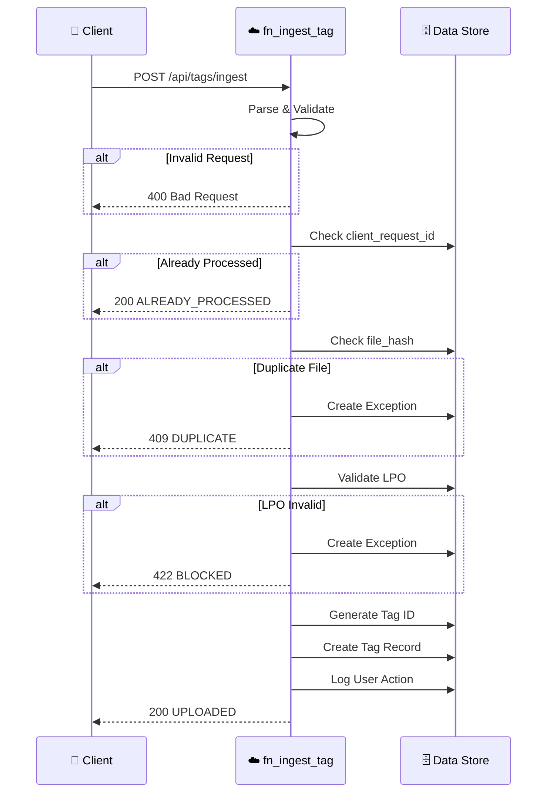

[Home](../../index.md) > [API Reference](./index.md) > Tag Ingestion

# Tag Ingestion API

> **Endpoint:** `POST /api/tags/ingest` | **Version:** 1.0.0+ | **Last Updated:** 2026-02-06

Upload tag sheets to the system with automatic validation, deduplication, and LPO linkage.

---

## Quick Reference

```bash
curl -X POST "{BASE_URL}/api/tags/ingest" \
  -H "Content-Type: application/json" \
  -d '{
    "lpo_sap_reference": "SAP-001",
    "required_area_m2": 50.0,
    "requested_delivery_date": "2026-02-01",
    "uploaded_by": "user@company.com"
  }'
```

---

## Request Flow



---

## Request Schema

### Endpoint

```http
POST /api/tags/ingest
Content-Type: application/json
```

### Request Body

```json
{
  "client_request_id": "uuid-v4",
  "tag_id": "TAG-20260105-0001",
  "lpo_id": "LPO-1234",
  "customer_lpo_ref": "CUST-LPO-99",
  "lpo_sap_reference": "SAP-001",
  "required_area_m2": 120.25,
  "requested_delivery_date": "2026-02-01",
  "files": [
    {
      "file_type": "tag_sheet",
      "file_content": "base64-content...",
      "file_name": "TAG-123.xlsx"
    }
  ],
  "uploaded_by": "user@company.com",
  "tag_name": "TAG-123 Rev A",
  "received_through": "Email",
  "user_remarks": "Urgent delivery needed",
  "location": "Warehouse-A",
  "remarks": "Priority shipment"
}
```

### Request Fields

| Field | Type | Required | Description |
|-------|------|----------|-------------|
| `client_request_id` | string (UUID) | Yes¹ | Idempotency key. Auto-generated if not provided. |
| `tag_id` | string | No | Custom tag ID. Auto-generated if not provided. |
| `lpo_id` | string | No² | Internal LPO identifier |
| `customer_lpo_ref` | string | No² | Customer's LPO reference |
| `lpo_sap_reference` | string | No² | SAP reference for the LPO |
| `required_area_m2` | number | Yes | Required area in square meters |
| `requested_delivery_date` | string (ISO) | Yes | Delivery date in ISO format (YYYY-MM-DD) |
| `files` | array | Yes* | List of files (see FileAttachment). *At least 1 required. |
| `file_url` | string (URL) | Depr. | Legacy single file URL support |
| `file_content` | string (b64) | Depr. | Legacy single file content support |
| `uploaded_by` | string (email) | Yes | User who uploaded the tag |
| `tag_name` | string | No | Display name for the tag |
| `received_through` | string | No | How the tag was received: `Email`, `Whatsapp`, or `API` (default) |
| `user_remarks` | string | No | User-entered remarks (separate from system traces) |
| `location` | string | No | Location from staging sheet (v1.6.8) |
| `remarks` | string | No | Remarks from staging sheet (v1.6.8) |
| `metadata` | object | No | Additional metadata (free-form) |

> **Notes:**
> - ¹ Recommended to provide for idempotency guarantees
> - ² At least one LPO reference field is required
> - **v1.6.3:** Implements **Robust Attachment Handling**. Pass any valid URL in `file_url`; if the URL exceeds Smartsheet's 500-character limit, the system automatically downloads and re-uploads the file.
> - **v1.6.8:** Added `location` and `remarks` for staging sheet integration

---

## Response Schemas

### Success (200 OK)

```json
{
  "status": "UPLOADED",
  "tag_id": "TAG-0001",
  "tag_name": "TAG-123 Rev A",
  "row_id": 12345678,
  "file_hash": "sha256:abcd1234...",
  "trace_id": "trace-abc123def456",
  "message": "Tag uploaded successfully"
}
```

### Already Processed (200 OK)

Idempotency - request with same `client_request_id` already processed.

```json
{
  "status": "ALREADY_PROCESSED",
  "tag_id": "TAG-0001",
  "trace_id": "trace-abc123def456",
  "message": "This request was already processed"
}
```

### Duplicate File (409 Conflict)

File with same hash already exists in system.

```json
{
  "status": "DUPLICATE",
  "existing_tag_id": "TAG-0001",
  "exception_id": "EX-0001",
  "trace_id": "trace-abc123def456",
  "message": "This file has already been uploaded"
}
```

### LPO Not Found (422 Unprocessable)

Referenced LPO does not exist.

```json
{
  "status": "BLOCKED",
  "exception_id": "EX-0002",
  "trace_id": "trace-abc123def456",
  "message": "Referenced LPO not found"
}
```

### LPO On Hold (422 Unprocessable)

Referenced LPO has status "On Hold".

```json
{
  "status": "BLOCKED",
  "exception_id": "EX-0003",
  "trace_id": "trace-abc123def456",
  "message": "LPO is currently on hold"
}
```

### Insufficient PO Balance (422 Unprocessable)

Requested area exceeds available PO balance (with 5% tolerance).

```json
{
  "status": "BLOCKED",
  "exception_id": "EX-0004",
  "trace_id": "trace-abc123def456",
  "message": "Insufficient PO balance. Required: 120.25, Available: 50.0"
}
```

### Validation Error (400 Bad Request)

Request body failed validation.

```json
{
  "status": "ERROR",
  "trace_id": "trace-abc123def456",
  "message": "Validation error: required_area_m2 must be positive"
}
```

---

## Code Examples

### cURL

```bash
curl -X POST "http://localhost:7071/api/tags/ingest" \
  -H "Content-Type: application/json" \
  -d '{
    "client_request_id": "550e8400-e29b-41d4-a716-446655440000",
    "lpo_sap_reference": "SAP-001",
    "required_area_m2": 50.0,
    "requested_delivery_date": "2026-02-01",
    "uploaded_by": "john.doe@company.com"
  }'
```

### Python

```python
import requests
import uuid

response = requests.post(
    "http://localhost:7071/api/tags/ingest",
    json={
        "client_request_id": str(uuid.uuid4()),
        "lpo_sap_reference": "SAP-001",
        "required_area_m2": 50.0,
        "requested_delivery_date": "2026-02-01",
        "uploaded_by": "john.doe@company.com"
    }
)

print(response.json())
```

### PowerShell

```powershell
$body = @{
    client_request_id = [guid]::NewGuid().ToString()
    lpo_sap_reference = "SAP-001"
    required_area_m2 = 50.0
    requested_delivery_date = "2026-02-01"
    uploaded_by = "john.doe@company.com"
} | ConvertTo-Json

$response = Invoke-RestMethod `
    -Uri "http://localhost:7071/api/tags/ingest" `
    -Method Post `
    -Body $body `
    -ContentType "application/json"

$response | ConvertTo-Json
```

---

## Business Rules

1. **Idempotency:** Requests with duplicate `client_request_id` return cached response
2. **Deduplication:** Files with duplicate SHA-256 hash create exception and return 409
3. **LPO Validation:** 
   - LPO must exist in system
   - LPO must not be "On Hold"
   - Sufficient PO balance available (with 5% tolerance)
4. **Auto-ID Generation:** If `tag_id` not provided, generates `TAG-YYYYMMDD-NNNN` format
5. **Multi-File Support (v1.6.3):** Supports multiple file attachments per tag
6. **Staging Integration (v1.6.8):** Accepts `location` and `remarks` from staging sheet

---

## Related Documentation

- [TagIngestRequest Model](../data/models.md#tagingestrequest) - Complete schema definition
- [LPO Service](../data/services.md#lpo-service) - LPO validation logic
- [Exception Handling](./index.md#error-handling) - Error response patterns
- [LPO Ingestion](./lpo-ingestion.md) - Create LPO records first
