```mermaid
sequenceDiagram
    participant C as 📱 Client
    participant F as ☁️ fn_ingest_tag
    participant DB as 🗄️ Data Store

    C->>F: POST /api/tags/ingest
    
    F->>F: Parse & Validate
    alt Invalid Request
        F-->>C: 400 Bad Request
    end
    
    F->>DB: Check client_request_id
    alt Already Processed
        F-->>C: 200 ALREADY_PROCESSED
    end
    
    F->>DB: Check file_hash
    alt Duplicate File
        F->>DB: Create Exception
        F-->>C: 409 DUPLICATE
    end
    
    F->>DB: Validate LPO
    alt LPO Invalid
        F->>DB: Create Exception
        F-->>C: 422 BLOCKED
    end
    
    F->>DB: Generate Tag ID
    F->>DB: Create Tag Record
    F->>DB: Log User Action
    F-->>C: 200 UPLOADED
```

```mermaid
sequenceDiagram
    participant C as 📱 Client
    participant F as ☁️ fn_lpo_ingest
    participant DB as 🗄️ Data Store

    C->>F: POST /api/lpos/ingest
    
    F->>F: Parse & Validate
    alt Invalid Request
        F-->>C: 400 Bad Request
    end
    
    F->>DB: Check client_request_id
    alt Already Processed
        F-->>C: 200 ALREADY_PROCESSED
    end
    
    F->>DB: Check SAP Reference
    alt Duplicate SAP Ref
        F->>DB: Create Exception
        F-->>C: 409 DUPLICATE
    end
    
    F->>DB: Create LPO Record
    F->>DB: Attach Files
    F->>DB: Log User Action
    F-->>C: 200 OK
```

```mermaid
sequenceDiagram
    participant C as 📱 Client
    participant F as ☁️ fn_schedule_tag
    participant DB as 🗄️ Data Store

    C->>F: POST /api/production/schedule
    
    F->>F: Parse & Validate
    alt Invalid Request
        F-->>C: 400 Bad Request
    end
    
    F->>DB: Check client_request_id
    alt Already Processed
        F-->>C: 200 ALREADY_PROCESSED
    end
    
    F->>DB: Validate Tag
    alt Tag Invalid
        F->>DB: Create Exception
        F-->>C: 422 BLOCKED
    end
    
    F->>DB: Validate Machine
    alt Machine Invalid
        F->>DB: Create Exception
        F-->>C: 422 BLOCKED
    end
    
    F->>DB: Check PO Balance
    alt Insufficient Balance
        F->>DB: Create Exception
        F-->>C: 422 BLOCKED
    end
    
    F->>DB: Create Schedule Record
    F->>DB: Log User Action
    F-->>C: 200 OK (schedule_id, deadline)
```

```mermaid
sequenceDiagram
    participant C as 📱 Client
    participant F as ☁️ fn_parse_nesting
    participant DB as 🗄️ Smartsheet
    
    C->>F: POST /api/nesting/parse
    
    F->>F: Compute File Hash
    F->>DB: Check Duplicate (Hash/ReqID)
    alt Duplicate
        F-->>C: 409 CONFLICT
    end
    
    F->>F: Parse Header (Tag ID)
    F->>DB: Validate Tag & LPO
    alt Invalid/Missing
        F-->>C: 422 UNPROCESSABLE
    end
    
    F->>F: Parse All Sheets
    F->>DB: Log Execution & Attach File
    
    alt Parsing Warnings
        F->>DB: Create Exception Record
    end
    
    F-->>C: 200 OK (with data)
```

# 📘 API Reference

> **Document Type:** Reference | **Version:** 1.5.0 | **Last Updated:** 2026-01-22

This document provides complete API documentation for all Azure Functions endpoints in the Ducts Manufacturing Inventory Management System.

---

## Table of Contents

1. [Overview](#overview)
2. [Authentication](#authentication)
3. [Common Headers](#common-headers)
4. [Response Format](#response-format)
5. [Endpoints](#endpoints)
   - [Tag Ingestion](#tag-ingestion)
   - [LPO Ingestion](#lpo-ingestion-v120) (v1.2.0)
   - [LPO Update](#lpo-update-v120) (v1.2.0)
   - [Production Scheduling](#production-scheduling-v130) (v1.3.0)
   - [Nesting Parser](#nesting-parser-v131) (v1.3.1)
   - [Event Dispatcher](#event-dispatcher-v140) (v1.4.0)
6. [Webhook Management](#webhook-management-function_adapter) (function_adapter)
7. [Error Handling](#error-handling)
8. [Data Models](#data-models)
9. [Rate Limiting](#rate-limiting)

---

## Overview

### Base URLs

| Environment | Base URL |
|-------------|----------|
| Local Development | `http://localhost:7071` |
| Development | `https://dev-fn-ducts.azurewebsites.net` |
| UAT | `https://uat-fn-ducts.azurewebsites.net` |
| Production | `https://prod-fn-ducts.azurewebsites.net` |

### API Versioning

Currently, the API is at version 1.0. Future versions will use URL path versioning:
- `/api/v1/tags/ingest`
- `/api/v2/tags/ingest`

---

## Authentication

### Azure AD Authentication (Production)

All production endpoints require Azure AD authentication:

```http
Authorization: Bearer <access_token>
```

### Function Key Authentication (Development)

For local development and testing, use function keys:

```http
x-functions-key: <your_function_key>
```

Or as a query parameter:
```
?code=<your_function_key>
```

### Getting Function Keys

1. Navigate to Azure Portal → Function App → App Keys
2. Copy the "default" or create a new key
3. Use in requests as shown above

---

## Common Headers

### Request Headers

| Header | Required | Description |
|--------|----------|-------------|
| `Content-Type` | Yes | Must be `application/json` |
| `Authorization` | Prod | Bearer token from Azure AD |
| `x-functions-key` | Dev | Function key for authentication |
| `x-correlation-id` | No | Optional correlation ID for tracing |

### Response Headers

| Header | Description |
|--------|-------------|
| `Content-Type` | Always `application/json` |
| `x-trace-id` | System-generated trace ID |
| `X-RateLimit-Remaining` | Remaining requests in window |

---

## Response Format

### Success Response

All successful responses follow this structure:

```json
{
  "status": "SUCCESS_STATUS",
  "trace_id": "trace-abc123def456",
  "message": "Human-readable success message",
  "data": { ... }
  // ... endpoint-specific fields
}
```

### EXCEPTION_LOGGED Info

SOTA handlers return **HTTP 200** with `status: EXCEPTION_LOGGED` when a controlled exception (e.g., validation error) is caught and logged to the Exception Sheet. This ensures the client knows the request was processed safely, even if the business logic failed.

```json
{
  "status": "EXCEPTION_LOGGED",
  "trace_id": "trace-abc123def456",
  "message": "Human-readable message about the exception",
  "exception_id": "EX-0001"
}
```

### Error Response

All error responses follow this structure:

```json
{
  "status": "ERROR_STATUS",
  "trace_id": "trace-abc123def456",
  "message": "Human-readable error message",
  "exception_id": "EX-0001"  // If exception was created
}
```

### HTTP Status Codes

| Code | Meaning | Usage |
|------|---------|-------|
| 200 | Success | Request completed successfully |
| 400 | Bad Request | Invalid request format or validation error |
| 401 | Unauthorized | Missing or invalid authentication |
| 403 | Forbidden | Insufficient permissions |
| 404 | Not Found | Resource not found |
| 409 | Conflict | Duplicate resource (e.g., duplicate file upload) |
| 422 | Unprocessable | Business rule violation (e.g., LPO on hold) |
| 429 | Rate Limited | Too many requests |
| 500 | Server Error | Internal server error |

---

## Endpoints

### Tag Ingestion

Ingests a new tag sheet into the system with full validation.

#### Request Flow



#### Request

```http
POST /api/tags/ingest
Content-Type: application/json
```

#### Request Body

```json
{
  "client_request_id": "uuid-v4",
  "tag_id": "TAG-20260105-0001",
  "lpo_id": "LPO-1234",
  "customer_lpo_ref": "CUST-LPO-99",
  "lpo_sap_reference": "SAP-001",
  "required_area_m2": 120.25,
  "requested_delivery_date": "2026-02-01",
  "file_url": "https://tenant.sharepoint/.../TAG-123.xlsx",
  "file_content": "base64-encoded-file-content...",
  "original_file_name": "TAG-123_cutexport_v1.xlsx",
  "uploaded_by": "user@company.com",
  "tag_name": "TAG-123 Rev A",
  "received_through": "Email",
  "user_remarks": "Urgent delivery needed",
  "metadata": {
    "truck_size": "small",
    "notes": "urgent"
  }
}
```

#### Request Fields

| Field | Type | Required | Description |
|-------|------|----------|-------------|
| `client_request_id` | string (UUID) | Yes¹ | Idempotency key. Auto-generated if not provided. |
| `tag_id` | string | No | Custom tag ID. Auto-generated if not provided. |
| `lpo_id` | string | No² | Internal LPO identifier |
| `customer_lpo_ref` | string | No² | Customer's LPO reference |
| `lpo_sap_reference` | string | No² | SAP reference for the LPO |
| `required_area_m2` | number | Yes | Required area in square meters |
| `requested_delivery_date` | string (ISO) | Yes | Delivery date in ISO format (YYYY-MM-DD) |
| `file_url` | string (URL) | No³ | URL to the tag sheet file |
| `file_content` | string (base64) | No³ | Base64-encoded file content (alternative to file_url) |
| `original_file_name` | string | No | Original filename for display |
| `uploaded_by` | string (email) | Yes | User who uploaded the tag |
| `tag_name` | string | No | Display name for the tag |
| `received_through` | string | No | How the tag was received: `Email`, `Whatsapp`, or `API` (default) |
| `user_remarks` | string | No | User-entered remarks (separate from system traces) |
| `metadata` | object | No | Additional metadata (free-form) |

> ³ Either `file_url` or `file_content` can be provided for file hash calculation and attachment

> ¹ Recommended to provide for idempotency guarantees
> ² At least one LPO reference field is required

#### Response: Success (200)

```json
{
  "status": "UPLOADED",
  "tag_id": "TAG-0001",
  "tag_name": "TAG-123 Rev A",
  "row_id": 12345678,
  "file_hash": "sha256:abcd1234...",
  "trace_id": "trace-abc123def456",
  "message": "Tag uploaded successfully"
}
```

#### Response: Already Processed (200)

```json
{
  "status": "ALREADY_PROCESSED",
  "tag_id": "TAG-0001",
  "trace_id": "trace-abc123def456",
  "message": "This request was already processed"
}
```

#### Response: Duplicate File (409)

```json
{
  "status": "DUPLICATE",
  "existing_tag_id": "TAG-0001",
  "exception_id": "EX-0001",
  "trace_id": "trace-abc123def456",
  "message": "This file has already been uploaded"
}
```

#### Response: LPO Not Found (422)

```json
{
  "status": "BLOCKED",
  "exception_id": "EX-0002",
  "trace_id": "trace-abc123def456",
  "message": "Referenced LPO not found"
}
```

#### Response: LPO On Hold (422)

```json
{
  "status": "BLOCKED",
  "exception_id": "EX-0003",
  "trace_id": "trace-abc123def456",
  "message": "LPO is currently on hold"
}
```

#### Response: Insufficient PO Balance (422)

```json
{
  "status": "BLOCKED",
  "exception_id": "EX-0004",
  "trace_id": "trace-abc123def456",
  "message": "Insufficient PO balance. Required: 120.25, Available: 50.0"
}
```

#### Response: Validation Error (400)

```json
{
  "status": "ERROR",
  "trace_id": "trace-abc123def456",
  "message": "Validation error: required_area_m2 must be positive"
}
```

#### Example: cURL

```bash
curl -X POST "http://localhost:7071/api/tags/ingest" \
  -H "Content-Type: application/json" \
  -d '{
    "client_request_id": "550e8400-e29b-41d4-a716-446655440000",
    "lpo_sap_reference": "SAP-001",
    "required_area_m2": 50.0,
    "requested_delivery_date": "2026-02-01",
    "uploaded_by": "john.doe@company.com"
  }'
```

#### Example: Python

```python
import requests
import uuid

response = requests.post(
    "http://localhost:7071/api/tags/ingest",
    json={
        "client_request_id": str(uuid.uuid4()),
        "lpo_sap_reference": "SAP-001",
        "required_area_m2": 50.0,
        "requested_delivery_date": "2026-02-01",
        "uploaded_by": "john.doe@company.com"
    }
)

print(response.json())
```

#### Example: PowerShell

```powershell
$body = @{
    client_request_id = [guid]::NewGuid().ToString()
    lpo_sap_reference = "SAP-001"
    required_area_m2 = 50.0
    requested_delivery_date = "2026-02-01"
    uploaded_by = "john.doe@company.com"
} | ConvertTo-Json

$response = Invoke-RestMethod `
    -Uri "http://localhost:7071/api/tags/ingest" `
    -Method Post `
    -Body $body `
    -ContentType "application/json"

$response | ConvertTo-Json
```

---

### LPO Ingestion (v1.2.0)

Creates a new LPO record in the system with validation and SharePoint folder path generation.

#### Request Flow



#### Request

```http
POST /api/lpos/ingest
Content-Type: application/json
```

#### Request Body

```json
{
  "client_request_id": "uuid-v4",
  "sap_reference": "PTE-185",
  "customer_name": "Acme Utilities",
  "project_name": "Project X",
  "brand": "KIMMCO",
  "po_quantity_sqm": 1250.5,
  "price_per_sqm": 150.00,
  "customer_lpo_ref": "CUST-LPO-1234",
  "terms_of_payment": "30 Days Credit",
  "wastage_pct": 3.0,
  "remarks": "Priority delivery",
  "files": [
    {
      "file_type": "lpo",
      "file_url": "https://sharepoint/.../po.pdf",
      "file_name": "PO-185.pdf"
    },
    {
      "file_type": "costing",
      "file_content": "base64-encoded...",
      "file_name": "costing.xlsx"
    }
  ],
  "uploaded_by": "sales@company.com"
}
```

#### Request Fields

| Field | Type | Required | Description |
|-------|------|----------|-------------|
| `client_request_id` | string (UUID) | Yes¹ | Idempotency key |
| `sap_reference` | string | Yes | External SAP reference (unique) |
| `customer_name` | string | Yes | Customer name |
| `project_name` | string | Yes | Project name |
| `brand` | string | Yes | Brand: `KIMMCO` or `WTI` |
| `po_quantity_sqm` | number | Yes | PO quantity in sqm (must be > 0) |
| `price_per_sqm` | number | Yes | Price per sqm (must be > 0) |
| `customer_lpo_ref` | string | No | Customer's LPO reference |
| `terms_of_payment` | string | No | Payment terms (default: "30 Days Credit") |
| `wastage_pct` | number | No | Wastage percentage (0-20%) |
| `remarks` | string | No | User remarks |
| `files` | array | No | File attachments (multi-file support) |
| `files[].file_type` | string | Yes | Type: `lpo`, `costing`, `amendment`, `other` |
| `files[].file_url` | string | No² | URL to file |
| `files[].file_content` | string | No² | Base64-encoded file content |
| `files[].file_name` | string | No | Original filename |
| `uploaded_by` | string | Yes | User who created the LPO |

> ¹ Auto-generated if not provided  
> ² Either `file_url` or `file_content` is required per file

#### Response: Success (200)

```json
{
  "status": "OK",
  "sap_reference": "PTE-185",
  "folder_path": "/LPOs/PTE-185_Acme_Utilities",
  "trace_id": "trace-abc123def456",
  "message": "LPO created successfully"
}
```

#### Response: Duplicate SAP Reference (409)

```json
{
  "status": "DUPLICATE",
  "sap_reference": "PTE-185",
  "exception_id": "EX-0005",
  "trace_id": "trace-abc123def456",
  "message": "SAP Reference already exists"
}
```

---

### LPO Update (v1.2.0)

Updates an existing LPO record. Partial updates supported.

#### Request

```http
PUT /api/lpos/update
Content-Type: application/json
```

#### Request Body

```json
{
  "client_request_id": "uuid-v4",
  "sap_reference": "PTE-185",
  "po_quantity_sqm": 1500.0,
  "lpo_status": "Active",
  "remarks": "Updated quantity",
  "updated_by": "manager@company.com"
}
```

#### Request Fields

| Field | Type | Required | Description |
|-------|------|----------|-------------|
| `client_request_id` | string (UUID) | Yes¹ | Idempotency key |
| `sap_reference` | string | Yes | SAP reference to update |
| `po_quantity_sqm` | number | No | New PO quantity |
| `price_per_sqm` | number | No | New price per sqm |
| `lpo_status` | string | No | New status |
| `remarks` | string | No | Updated remarks |
| `updated_by` | string | Yes | User performing update |

#### Response: Success (200)

```json
{
  "status": "OK",
  "sap_reference": "PTE-185",
  "trace_id": "trace-abc123def456",
  "message": "LPO updated successfully"
}
```

#### Response: Not Found (404)

```json
{
  "status": "NOT_FOUND",
  "sap_reference": "PTE-999",
  "trace_id": "trace-abc123def456",
  "message": "SAP Reference not found"
}
```

#### Response: Quantity Conflict (422)

```json
{
  "status": "BLOCKED",
  "exception_id": "EX-0006",
  "trace_id": "trace-abc123def456",
  "message": "Cannot reduce PO quantity below delivered amount"
}
```

---

### Production Scheduling (v1.3.0)

Schedules a tag for production on a specific machine and shift.

#### Request Flow



#### Request

```http
POST /api/production/schedule
Content-Type: application/json
```

#### Request Body

```json
{
  "client_request_id": "uuid-v4",
  "tag_id": "TAG-0001",
  "machine_id": "CUT-001",
  "planned_date": "2026-01-15",
  "shift": "Morning",
  "planned_quantity_sqm": 50.0,
  "scheduled_by": "planner@company.com",
  "notes": "Priority order"
}
```

#### Request Fields

| Field | Type | Required | Description |
|-------|------|----------|-------------|
| `client_request_id` | string (UUID) | Yes¹ | Idempotency key |
| `tag_id` | string | Yes | Tag ID to schedule (e.g., TAG-0001) |
| `machine_id` | string | Yes | Machine ID (e.g., CUT-001) |
| `planned_date` | string (ISO) | Yes | Planned production date |
| `shift` | string | Yes | Shift: `Morning` or `Evening` |
| `planned_quantity_sqm` | number | Yes | Planned quantity in sqm (> 0) |
| `scheduled_by` | string | Yes | User creating the schedule |
| `notes` | string | No | Additional notes |

> ¹ Auto-generated if not provided

#### Validations Performed

1. **Tag Validation**: Tag must exist and status ≠ CANCELLED/CLOSED
2. **Machine Validation**: Machine must exist and be OPERATIONAL
3. **PO Balance Check**: (committed + planned) ≤ PO quantity (with 5% tolerance)
4. **Duplicate Check**: Same tag already scheduled → 409 DUPLICATE

#### Response: Success (200)

```json
{
  "status": "OK",
  "schedule_id": "SCHED-0001",
  "tag_id": "TAG-0001",
  "machine_id": "CUT-001",
  "planned_date": "2026-01-15",
  "shift": "Morning",
  "next_action_deadline": "2026-01-14T18:00:00",
  "trace_id": "trace-abc123def456",
  "message": "Schedule created. Nesting file required by 2026-01-14 18:00"
}
```

> **T-1 Deadline**: `next_action_deadline` indicates when the nesting file must be uploaded (18:00 the day before).

#### Response: Tag Not Found (422)

```json
{
  "status": "BLOCKED",
  "exception_id": "EX-0007",
  "trace_id": "trace-abc123def456",
  "message": "Tag TAG-9999 not found"
}
```

#### Response: Machine Under Maintenance (422)

```json
{
  "status": "BLOCKED",
  "exception_id": "EX-0008",
  "trace_id": "trace-abc123def456",
  "message": "Machine CUT-001 is under maintenance"
}
```

---

### Nesting Parser (v1.5.0)

**Orchestration Logic (v2.0.0)**: SOTA implementation with robust validation and idempotency.

Parses Eurosoft CutExpert nesting export files and extracts structured data.

#### Key Features
- **Idempotency**: Duplicate uploads (same file hash or client_request_id) are blocked.
- **Fail-Fast**: Validates Tag ID existence and LPO ownership before parsing.
- **Orchestration**: Automatically logs to `NESTING_LOG`, attaches file to Tag Registry, and creates exceptions if parsing generally succeeds but has warnings.

#### Request Flow



#### Request

```http
POST /api/nesting/parse
Content-Type: multipart/form-data
x-client-request-id: <uuid> (optional)
```

#### Request Body

```
file: <binary Excel file (.xls/.xlsx)>
```

Or with base64:

```json
{
  "file_content": "base64-encoded-excel-content",
  "file_name": "TAG-1234_nesting_export.xlsx"
}
```

#### Sheets Parsed

| Sheet | Data Extracted |
|-------|----------------|
| `Project parameters` | Tag ID, material spec, thickness, inventory impact |
| `Panels info` | Sheet utilization, waste metrics, remnant area |
| `Flanges` | Profile consumption (U, F, H), lengths, remainders |
| `Other components` | Consumables: silicone, tape, glue (with extra %) |
| `Machine info` | Telemetry: cut lengths, travel distance, times |
| `Delivery order` | Finished goods line items, geometry, quantities |

#### Response: Success (200)

```json
{
  "status": "SUCCESS",
  "tag_id": "TAG-1234",
  "data": {
    "meta_data": {
      "project_ref_id": "TAG-1234",
      "project_name": "Order ABC",
      "validation_status": "OK"
    },
    "raw_material_panel": {
      "material_spec_name": "PIR 25mm",
      "thickness_mm": 25.0,
      "inventory_impact": {
        "utilized_sheets_count": 5,
        "net_reusable_remnant_area_m2": 1.25
      },
      "efficiency_metrics": {
        "nesting_waste_m2": 0.45
      }
    },
    "profiles_and_flanges": [
      {
        "profile_type": "U PROFILE",
        "total_length_m": 45.5,
        "remaining_m": 2.3
      }
    ],
    "consumables": {
      "silicone": {
        "consumption_kg": 0.85,
        "extra_pct": 5.0
      },
      "aluminum_tape": {
        "consumption_m": 12.5,
        "extra_pct": 3.0
      }
    },
    "flange_accessories": {
      "gi_corners_qty": 24,
      "gi_corners_cost_aed": 48.0,
      "pvc_corners_qty": 16,
      "pvc_corners_cost_aed": 32.0
    },
    "machine_telemetry": {
      "blade_wear_45_m": 15.2,
      "blade_wear_90_m": 28.4,
      "gantry_travel_rapid_m": 156.8,
      "time_2x45_cuts_sec": 45
    },
    "delivery_order_items": [
      {
        "line_id": "1",
        "description": "Duct Section A",
        "qty_produced": 10,
        "area_m2": 5.5,
        "length_m": 2.0,
        "geometry": {
          "mouth_a_x": 400,
          "mouth_a_y": 300
        }
      }
    ]
  },
  "warnings": [],
  "trace_id": "trace-abc123def456"
}
```

#### Response: Partial (200)

When some sheets are missing or have extraction issues:

```json
{
  "status": "PARTIAL",
  "tag_id": "TAG-1234",
  "data": { ... },
  "warnings": [
    "Sheet 'Machine info' not found",
    "Could not extract 'flange_accessories'"
  ],
  "trace_id": "trace-abc123def456"
}
```

#### Response: Error (200)

When critical data is missing (e.g., Tag ID):

```json
{
  "status": "ERROR",
  "tag_id": null,
  "error_message": "Missing Tag ID in PROJECT REFERENCE or PROJECT NAME",
  "validation_errors": ["Tag ID is required"],
  "trace_id": "trace-abc123def456"
}
```

> **Note:** The function returns 200 even for parsing errors to provide detailed JSON response. The `status` field indicates SUCCESS, PARTIAL, or ERROR.

---

### Event Dispatcher (v1.4.0)

Central event router that receives Smartsheet webhook events and dispatches to appropriate core functions based on ID-based routing configuration.

#### Architecture

```mermaid
flowchart LR
    SS[📊 Smartsheet]
    WH[🔔 Webhook Adapter]
    ED[⚙️ fn_event_dispatcher]
    LPO[fn_lpo_ingest]
    TAG[fn_ingest_tag]
    SCHED[fn_schedule_tag]
    
    SS -->|Webhook| WH
    WH -->|POST| ED
    ED -->|Route| LPO
    ED -->|Route| TAG
    ED -->|Route| SCHED
    
    style ED fill:#FF9800,color:#fff
```



#### Request

```http
POST /api/events/process-row
Content-Type: application/json
x-trace-id: trace-abc123 (optional)
```

#### Request Body

```json
{
  "sheet_id": 123456789012345,
  "row_id": 987654321098765,
  "action": "created",
  "timestamp": "2026-01-20T12:00:00Z"
}
```

#### Request Fields

| Field | Type | Required | Description |
|-------|------|----------|-------------|
| `sheet_id` | integer | Yes | Smartsheet sheet ID (immutable) |
| `row_id` | integer | Yes | Row ID that triggered the event |
| `action` | string | Yes | Event action: `created`, `updated`, `deleted` |
| `timestamp` | string | No | ISO 8601 timestamp of event |

#### Response: Processed (200)

```json
{
  "status": "OK",
  "handler": "lpo_ingest",
  "result": { ... },
  "trace_id": "trace-abc123def456",
  "processing_time_ms": 125.5
}
```

#### Response: Ignored (200)

When no route is configured for the sheet/action:

```json
{
  "status": "IGNORED",
  "message": "No route configured for this event",
  "trace_id": "trace-abc123def456",
  "processing_time_ms": 5.2
}
```

#### Response: Not Implemented (200)

When handler exists in config but not yet implemented:

```json
{
  "status": "NOT_IMPLEMENTED",
  "handler": "lpo_status_change",
  "message": "Handler 'lpo_status_change' is not yet implemented",
  "trace_id": "trace-abc123def456",
  "processing_time_ms": 3.1
}
```

#### Routing Configuration

Routes are defined in `event_routing.json` (externalized, no code changes needed):

```json
{
  "routes": [
    {
      "logical_sheet": "01H_LPO_INGESTION",
      "actions": {
        "created": { "handler": "lpo_ingest", "enabled": true }
      }
    }
  ],
  "handler_config": {
    "lpo_ingest": {
      "function": "fn_lpo_ingest",
      "timeout_seconds": 30
    }
  }
}
```

> **ID-Based Routing**: The dispatcher uses immutable Smartsheet IDs (not names), making it immune to sheet/column renames.

---

## Webhook Management (function_adapter)

These endpoints are served by the separate `function_adapter` Function App (port 7072 locally).

### Register Webhook

Registers a new webhook for a Smartsheet sheet.

```http
POST /api/webhooks/register
Content-Type: application/json
```

#### Request Body

```json
{
  "sheet_id": 123456789,
  "name": "TAG_REGISTRY Webhook"
}
```

#### Response

```json
{
  "status": "created",
  "webhook": {
    "id": 987654321,
    "name": "TAG_REGISTRY Webhook",
    "status": "ENABLED"
  },
  "message": "Webhook created. Check status - should be ENABLED after verification."
}
```

### List Webhooks

```http
GET /api/webhooks
```

#### Response

```json
{
  "count": 2,
  "webhooks": [
    { "id": 987654321, "name": "TAG_REGISTRY Webhook", "status": "ENABLED" },
    { "id": 987654322, "name": "LPO_MASTER Webhook", "status": "ENABLED" }
  ]
}
```

### Delete Webhook

```http
DELETE /api/webhooks/{webhook_id}
```

#### Response

```json
{
  "status": "deleted",
  "webhook_id": "987654321"
}
```

### Refresh Webhooks

Re-enables all disabled webhooks.

```http
POST /api/webhooks/refresh
```

#### Response

```json
{
  "status": "refreshed",
  "results": [
    { "id": 987654321, "name": "TAG_REGISTRY Webhook", "action": "skipped", "reason": "Already enabled" },
    { "id": 987654322, "name": "LPO_MASTER Webhook", "action": "enabled", "new_status": "ENABLED" }
  ]
}
```

---

## Error Handling

### Exception Reason Codes

| Code | HTTP Status | Description |
|------|-------------|-------------|
| `DUPLICATE_UPLOAD` | 409 | Same file hash already exists |
| `LPO_NOT_FOUND` | 422 | Referenced LPO doesn't exist |
| `LPO_ON_HOLD` | 422 | LPO is currently on hold |
| `INSUFFICIENT_PO_BALANCE` | 422 | Required area exceeds available balance |
| `MULTI_TAG_NEST` | 422 | Nesting file contains multiple tags |
| `PARSE_FAILED` | 422 | Could not parse nesting file |
| `SHORTAGE` | 422 | Insufficient inventory |
| `PICK_NEGATIVE` | 422 | Would cause negative stock |
| `OVERCONSUMPTION` | 422 | Exceeded allocation + tolerance |
| `PHYSICAL_VARIANCE` | 422 | Physical ≠ System count |
| `SAP_CREATE_FAILED` | 500 | SAP API call failed |
| `DUPLICATE_SAP_REF` | 409 | SAP Reference already exists (v1.2.0) |
| `SAP_REF_NOT_FOUND` | 404 | SAP Reference not found (v1.2.0) |
| `LPO_INVALID_DATA` | 422 | Invalid LPO data (v1.2.0) |
| `PO_QUANTITY_CONFLICT` | 422 | Cannot reduce PO quantity below committed (v1.2.0) |
| `DUPLICATE_LPO_FILE` | 409 | Same LPO file(s) already uploaded (v1.2.0) |
| `MACHINE_NOT_FOUND` | 422 | Machine ID not found (v1.3.0) |
| `MACHINE_MAINTENANCE` | 422 | Machine is under maintenance (v1.3.0) |
| `TAG_NOT_FOUND` | 422 | Tag ID not found (v1.3.0) |
| `TAG_INVALID_STATUS` | 422 | Tag status is CANCELLED or CLOSED (v1.3.0) |
| `DUPLICATE_SCHEDULE` | 409 | Tag already scheduled (v1.3.0) |

### Handling Errors in Client Code

```python
import requests

response = requests.post(url, json=payload)

if response.status_code == 200:
    data = response.json()
    if data["status"] == "UPLOADED":
        print(f"Success! Tag ID: {data['tag_id']}")
    elif data["status"] == "ALREADY_PROCESSED":
        print(f"Already processed: {data['tag_id']}")
        
elif response.status_code == 409:
    data = response.json()
    print(f"Duplicate file. Existing: {data['existing_tag_id']}")
    
elif response.status_code == 422:
    data = response.json()
    print(f"Blocked: {data['message']}")
    print(f"Exception ID: {data['exception_id']}")
    
elif response.status_code == 400:
    data = response.json()
    print(f"Validation error: {data['message']}")
    
else:
    print(f"Unexpected error: {response.status_code}")
```

---

## Data Models

### TagIngestRequest

```typescript
interface TagIngestRequest {
  client_request_id?: string;  // UUID v4
  tag_id?: string;
  lpo_id?: string;
  customer_lpo_ref?: string;
  lpo_sap_reference?: string;
  required_area_m2: number;    // Required
  requested_delivery_date: string;  // ISO date, Required
  file_url?: string;
  original_file_name?: string;
  uploaded_by: string;         // Required
  tag_name?: string;
  metadata?: Record<string, any>;
}
```

### TagIngestResponse

```typescript
interface TagIngestResponse {
  status: "UPLOADED" | "ALREADY_PROCESSED" | "DUPLICATE" | "BLOCKED" | "ERROR";
  tag_id?: string;
  tag_name?: string;
  row_id?: number;
  file_hash?: string;
  trace_id: string;
  message?: string;
  exception_id?: string;
  existing_tag_id?: string;
}
```

---

## Rate Limiting

### Limits

| Environment | Rate Limit | Window |
|-------------|------------|--------|
| Development | Unlimited | - |
| UAT | 100 req/min | 1 minute |
| Production | 300 req/min | 1 minute |

### Rate Limit Headers

```http
X-RateLimit-Limit: 300
X-RateLimit-Remaining: 299
X-RateLimit-Reset: 1704672000
```

### Handling Rate Limits

```python
import time

response = requests.post(url, json=payload)

if response.status_code == 429:
    reset_time = int(response.headers.get("X-RateLimit-Reset", 0))
    wait_time = max(0, reset_time - int(time.time()))
    print(f"Rate limited. Waiting {wait_time} seconds...")
    time.sleep(wait_time)
    # Retry
```

---

## Idempotency

### How It Works

1. Caller generates a unique `client_request_id` (UUID v4)
2. Caller sends request with this ID
3. Server checks if ID was already processed
4. If yes, returns cached response (no side effects)
5. If no, processes request and caches result

### Best Practices

```python
import uuid

# Generate once per logical operation
request_id = str(uuid.uuid4())

# Retry with same ID
for attempt in range(3):
    response = requests.post(url, json={
        "client_request_id": request_id,  # Same ID for all retries
        # ... other fields
    })
    
    if response.status_code in [200, 409, 422]:
        break  # Don't retry on these
    
    time.sleep(2 ** attempt)  # Exponential backoff
```

---

## Testing

### Test Endpoint (Local Only)

```bash
# Health check
curl http://localhost:7071/api/health

# Test with validation errors
curl -X POST http://localhost:7071/api/tags/ingest \
  -H "Content-Type: application/json" \
  -d '{}'  # Empty body triggers validation
```

### Test Data

For testing, use these SAP references in the UAT environment:

| SAP Reference | Status | PO Quantity |
|---------------|--------|-------------|
| SAP-TEST-001 | Active | 500 sqm |
| SAP-TEST-002 | On Hold | 500 sqm |
| SAP-TEST-003 | Active | 10 sqm (low balance) |

---

## Related Documentation

| Document | Description |
|----------|-------------|
| [Tag Ingestion Architecture](../../Specifications/tag_ingestion_architecture.md) | Detailed flow specification |
| [Data Dictionary](./data_dictionary.md) | Complete data models |
| [Error Codes](./error_codes.md) | Exception handling |

---

<p align="center">
  <a href="./data_dictionary.md">📊 Data Dictionary →</a>
</p>
