# 📘 API Reference

> **Document Type:** Reference | **Version:** 1.0.0 | **Last Updated:** 2026-01-08

This document provides complete API documentation for all Azure Functions endpoints in the Ducts Manufacturing Inventory Management System.

---

## Table of Contents

1. [Overview](#overview)
2. [Authentication](#authentication)
3. [Common Headers](#common-headers)
4. [Response Format](#response-format)
5. [Endpoints](#endpoints)
   - [Tag Ingestion](#tag-ingestion)
6. [Error Handling](#error-handling)
7. [Data Models](#data-models)
8. [Rate Limiting](#rate-limiting)

---

## Overview

### Base URLs

| Environment | Base URL |
|-------------|----------|
| Local Development | `http://localhost:7071` |
| Development | `https://dev-fn-ducts.azurewebsites.net` |
| UAT | `https://uat-fn-ducts.azurewebsites.net` |
| Production | `https://prod-fn-ducts.azurewebsites.net` |

### API Versioning

Currently, the API is at version 1.0. Future versions will use URL path versioning:
- `/api/v1/tags/ingest`
- `/api/v2/tags/ingest`

---

## Authentication

### Azure AD Authentication (Production)

All production endpoints require Azure AD authentication:

```http
Authorization: Bearer <access_token>
```

### Function Key Authentication (Development)

For local development and testing, use function keys:

```http
x-functions-key: <your_function_key>
```

Or as a query parameter:
```
?code=<your_function_key>
```

### Getting Function Keys

1. Navigate to Azure Portal → Function App → App Keys
2. Copy the "default" or create a new key
3. Use in requests as shown above

---

## Common Headers

### Request Headers

| Header | Required | Description |
|--------|----------|-------------|
| `Content-Type` | Yes | Must be `application/json` |
| `Authorization` | Prod | Bearer token from Azure AD |
| `x-functions-key` | Dev | Function key for authentication |
| `x-correlation-id` | No | Optional correlation ID for tracing |

### Response Headers

| Header | Description |
|--------|-------------|
| `Content-Type` | Always `application/json` |
| `x-trace-id` | System-generated trace ID |
| `X-RateLimit-Remaining` | Remaining requests in window |

---

## Response Format

### Success Response

All successful responses follow this structure:

```json
{
  "status": "SUCCESS_STATUS",
  "trace_id": "trace-abc123def456",
  "message": "Human-readable success message",
  // ... endpoint-specific fields
}
```

### Error Response

All error responses follow this structure:

```json
{
  "status": "ERROR_STATUS",
  "trace_id": "trace-abc123def456",
  "message": "Human-readable error message",
  "exception_id": "EX-0001"  // If exception was created
}
```

### HTTP Status Codes

| Code | Meaning | Usage |
|------|---------|-------|
| 200 | Success | Request completed successfully |
| 400 | Bad Request | Invalid request format or validation error |
| 401 | Unauthorized | Missing or invalid authentication |
| 403 | Forbidden | Insufficient permissions |
| 404 | Not Found | Resource not found |
| 409 | Conflict | Duplicate resource (e.g., duplicate file upload) |
| 422 | Unprocessable | Business rule violation (e.g., LPO on hold) |
| 429 | Rate Limited | Too many requests |
| 500 | Server Error | Internal server error |

---

## Endpoints

### Tag Ingestion

Ingests a new tag sheet into the system with full validation.

#### Request Flow

```mermaid
sequenceDiagram
    participant C as 📱 Client
    participant F as ☁️ fn_ingest_tag
    participant DB as 🗄️ Data Store

    C->>F: POST /api/tags/ingest
    
    F->>F: Parse & Validate
    alt Invalid Request
        F-->>C: 400 Bad Request
    end
    
    F->>DB: Check client_request_id
    alt Already Processed
        F-->>C: 200 ALREADY_PROCESSED
    end
    
    F->>DB: Check file_hash
    alt Duplicate File
        F->>DB: Create Exception
        F-->>C: 409 DUPLICATE
    end
    
    F->>DB: Validate LPO
    alt LPO Invalid
        F->>DB: Create Exception
        F-->>C: 422 BLOCKED
    end
    
    F->>DB: Generate Tag ID
    F->>DB: Create Tag Record
    F->>DB: Log User Action
    F-->>C: 200 UPLOADED
```



#### Request

```http
POST /api/tags/ingest
Content-Type: application/json
```

#### Request Body

```json
{
  "client_request_id": "uuid-v4",
  "tag_id": "TAG-20260105-0001",
  "lpo_id": "LPO-1234",
  "customer_lpo_ref": "CUST-LPO-99",
  "lpo_sap_reference": "SAP-001",
  "required_area_m2": 120.25,
  "requested_delivery_date": "2026-02-01",
  "file_url": "https://tenant.sharepoint/.../TAG-123.xlsx",
  "original_file_name": "TAG-123_cutexport_v1.xlsx",
  "uploaded_by": "user@company.com",
  "tag_name": "TAG-123 Rev A",
  "metadata": {
    "truck_size": "small",
    "notes": "urgent"
  }
}
```

#### Request Fields

| Field | Type | Required | Description |
|-------|------|----------|-------------|
| `client_request_id` | string (UUID) | Yes¹ | Idempotency key. Auto-generated if not provided. |
| `tag_id` | string | No | Custom tag ID. Auto-generated if not provided. |
| `lpo_id` | string | No² | Internal LPO identifier |
| `customer_lpo_ref` | string | No² | Customer's LPO reference |
| `lpo_sap_reference` | string | No² | SAP reference for the LPO |
| `required_area_m2` | number | Yes | Required area in square meters |
| `requested_delivery_date` | string (ISO) | Yes | Delivery date in ISO format (YYYY-MM-DD) |
| `file_url` | string (URL) | No | URL to the tag sheet file |
| `original_file_name` | string | No | Original filename for display |
| `uploaded_by` | string (email) | Yes | User who uploaded the tag |
| `tag_name` | string | No | Display name for the tag |
| `metadata` | object | No | Additional metadata (free-form) |

> ¹ Recommended to provide for idempotency guarantees
> ² At least one LPO reference field is required

#### Response: Success (200)

```json
{
  "status": "UPLOADED",
  "tag_id": "TAG-0001",
  "tag_name": "TAG-123 Rev A",
  "row_id": 12345678,
  "file_hash": "sha256:abcd1234...",
  "trace_id": "trace-abc123def456",
  "message": "Tag uploaded successfully"
}
```

#### Response: Already Processed (200)

```json
{
  "status": "ALREADY_PROCESSED",
  "tag_id": "TAG-0001",
  "trace_id": "trace-abc123def456",
  "message": "This request was already processed"
}
```

#### Response: Duplicate File (409)

```json
{
  "status": "DUPLICATE",
  "existing_tag_id": "TAG-0001",
  "exception_id": "EX-0001",
  "trace_id": "trace-abc123def456",
  "message": "This file has already been uploaded"
}
```

#### Response: LPO Not Found (422)

```json
{
  "status": "BLOCKED",
  "exception_id": "EX-0002",
  "trace_id": "trace-abc123def456",
  "message": "Referenced LPO not found"
}
```

#### Response: LPO On Hold (422)

```json
{
  "status": "BLOCKED",
  "exception_id": "EX-0003",
  "trace_id": "trace-abc123def456",
  "message": "LPO is currently on hold"
}
```

#### Response: Insufficient PO Balance (422)

```json
{
  "status": "BLOCKED",
  "exception_id": "EX-0004",
  "trace_id": "trace-abc123def456",
  "message": "Insufficient PO balance. Required: 120.25, Available: 50.0"
}
```

#### Response: Validation Error (400)

```json
{
  "status": "ERROR",
  "trace_id": "trace-abc123def456",
  "message": "Validation error: required_area_m2 must be positive"
}
```

#### Example: cURL

```bash
curl -X POST "http://localhost:7071/api/tags/ingest" \
  -H "Content-Type: application/json" \
  -d '{
    "client_request_id": "550e8400-e29b-41d4-a716-446655440000",
    "lpo_sap_reference": "SAP-001",
    "required_area_m2": 50.0,
    "requested_delivery_date": "2026-02-01",
    "uploaded_by": "john.doe@company.com"
  }'
```

#### Example: Python

```python
import requests
import uuid

response = requests.post(
    "http://localhost:7071/api/tags/ingest",
    json={
        "client_request_id": str(uuid.uuid4()),
        "lpo_sap_reference": "SAP-001",
        "required_area_m2": 50.0,
        "requested_delivery_date": "2026-02-01",
        "uploaded_by": "john.doe@company.com"
    }
)

print(response.json())
```

#### Example: PowerShell

```powershell
$body = @{
    client_request_id = [guid]::NewGuid().ToString()
    lpo_sap_reference = "SAP-001"
    required_area_m2 = 50.0
    requested_delivery_date = "2026-02-01"
    uploaded_by = "john.doe@company.com"
} | ConvertTo-Json

$response = Invoke-RestMethod `
    -Uri "http://localhost:7071/api/tags/ingest" `
    -Method Post `
    -Body $body `
    -ContentType "application/json"

$response | ConvertTo-Json
```

---

## Error Handling

### Exception Reason Codes

| Code | HTTP Status | Description |
|------|-------------|-------------|
| `DUPLICATE_UPLOAD` | 409 | Same file hash already exists |
| `LPO_NOT_FOUND` | 422 | Referenced LPO doesn't exist |
| `LPO_ON_HOLD` | 422 | LPO is currently on hold |
| `INSUFFICIENT_PO_BALANCE` | 422 | Required area exceeds available balance |
| `MULTI_TAG_NEST` | 422 | Nesting file contains multiple tags |
| `PARSE_FAILED` | 422 | Could not parse nesting file |
| `SHORTAGE` | 422 | Insufficient inventory |
| `PICK_NEGATIVE` | 422 | Would cause negative stock |
| `OVERCONSUMPTION` | 422 | Exceeded allocation + tolerance |
| `PHYSICAL_VARIANCE` | 422 | Physical ≠ System count |
| `SAP_CREATE_FAILED` | 500 | SAP API call failed |

### Handling Errors in Client Code

```python
import requests

response = requests.post(url, json=payload)

if response.status_code == 200:
    data = response.json()
    if data["status"] == "UPLOADED":
        print(f"Success! Tag ID: {data['tag_id']}")
    elif data["status"] == "ALREADY_PROCESSED":
        print(f"Already processed: {data['tag_id']}")
        
elif response.status_code == 409:
    data = response.json()
    print(f"Duplicate file. Existing: {data['existing_tag_id']}")
    
elif response.status_code == 422:
    data = response.json()
    print(f"Blocked: {data['message']}")
    print(f"Exception ID: {data['exception_id']}")
    
elif response.status_code == 400:
    data = response.json()
    print(f"Validation error: {data['message']}")
    
else:
    print(f"Unexpected error: {response.status_code}")
```

---

## Data Models

### TagIngestRequest

```typescript
interface TagIngestRequest {
  client_request_id?: string;  // UUID v4
  tag_id?: string;
  lpo_id?: string;
  customer_lpo_ref?: string;
  lpo_sap_reference?: string;
  required_area_m2: number;    // Required
  requested_delivery_date: string;  // ISO date, Required
  file_url?: string;
  original_file_name?: string;
  uploaded_by: string;         // Required
  tag_name?: string;
  metadata?: Record<string, any>;
}
```

### TagIngestResponse

```typescript
interface TagIngestResponse {
  status: "UPLOADED" | "ALREADY_PROCESSED" | "DUPLICATE" | "BLOCKED" | "ERROR";
  tag_id?: string;
  tag_name?: string;
  row_id?: number;
  file_hash?: string;
  trace_id: string;
  message?: string;
  exception_id?: string;
  existing_tag_id?: string;
}
```

---

## Rate Limiting

### Limits

| Environment | Rate Limit | Window |
|-------------|------------|--------|
| Development | Unlimited | - |
| UAT | 100 req/min | 1 minute |
| Production | 300 req/min | 1 minute |

### Rate Limit Headers

```http
X-RateLimit-Limit: 300
X-RateLimit-Remaining: 299
X-RateLimit-Reset: 1704672000
```

### Handling Rate Limits

```python
import time

response = requests.post(url, json=payload)

if response.status_code == 429:
    reset_time = int(response.headers.get("X-RateLimit-Reset", 0))
    wait_time = max(0, reset_time - int(time.time()))
    print(f"Rate limited. Waiting {wait_time} seconds...")
    time.sleep(wait_time)
    # Retry
```

---

## Idempotency

### How It Works

1. Caller generates a unique `client_request_id` (UUID v4)
2. Caller sends request with this ID
3. Server checks if ID was already processed
4. If yes, returns cached response (no side effects)
5. If no, processes request and caches result

### Best Practices

```python
import uuid

# Generate once per logical operation
request_id = str(uuid.uuid4())

# Retry with same ID
for attempt in range(3):
    response = requests.post(url, json={
        "client_request_id": request_id,  # Same ID for all retries
        # ... other fields
    })
    
    if response.status_code in [200, 409, 422]:
        break  # Don't retry on these
    
    time.sleep(2 ** attempt)  # Exponential backoff
```

---

## Testing

### Test Endpoint (Local Only)

```bash
# Health check
curl http://localhost:7071/api/health

# Test with validation errors
curl -X POST http://localhost:7071/api/tags/ingest \
  -H "Content-Type: application/json" \
  -d '{}'  # Empty body triggers validation
```

### Test Data

For testing, use these SAP references in the UAT environment:

| SAP Reference | Status | PO Quantity |
|---------------|--------|-------------|
| SAP-TEST-001 | Active | 500 sqm |
| SAP-TEST-002 | On Hold | 500 sqm |
| SAP-TEST-003 | Active | 10 sqm (low balance) |

---

## Related Documentation

| Document | Description |
|----------|-------------|
| [Tag Ingestion Architecture](../../Specifications/tag_ingestion_architecture.md) | Detailed flow specification |
| [Data Dictionary](./data_dictionary.md) | Complete data models |
| [Error Codes](./error_codes.md) | Exception handling |

---

<p align="center">
  <a href="./data_dictionary.md">📊 Data Dictionary →</a>
</p>
