# 📊 Data Dictionary

> **Document Type:** Reference | **Version:** 1.0.0 | **Last Updated:** 2026-01-08

This document provides a complete reference of all data models, sheets, and column definitions used in the Ducts Manufacturing Inventory Management System.

---

## Table of Contents

1. [Overview](#overview)
2. [Sheet Inventory](#sheet-inventory)
3. [Enumerations](#enumerations)
4. [Python Data Models](#python-data-models)
5. [Sheet Schemas](#sheet-schemas)
6. [Relationships](#relationships)

---

## Overview

### Data Architecture Principles

| Principle | Implementation |
|-----------|----------------|
| **Ledger-First** | All transactions are immutable, append-only |
| **Canonical Names** | Same column names across Smartsheet → SQL |
| **Separation** | Planned ≠ Allocated ≠ Consumed |
| **Snapshot + Txn** | Transactions explain *how*, snapshots explain *what* |

### Naming Conventions

| Type | Convention | Example |
|------|------------|---------|
| Sheet Names | `NN Description` | `01 LPO Master LOG` |
| Column Names | Title Case | `Customer Name` |
| ID Fields | `ENTITY_ID` pattern | `Tag ID`, `LPO ID` |
| Status Fields | `Status` or `ENTITY Status` | `LPO Status` |
| Dates | ISO 8601 | `2026-01-08` |
| Timestamps | ISO 8601 + Time | `2026-01-08T10:30:00` |

### Logical Names (Code Constants)

The system uses an **ID-First Architecture**. While the "Sheet Name" below refers to the user-facing name in Smartsheet, the application code uses **Logical Names** (e.g., `Sheet.TAG_REGISTRY`). These are mapped to physical IDs via the `workspace_manifest.json`.

*   **Physical Name**: `02 Tag Sheet Registry` (Mutable, User-facing)
*   **Logical Name**: `TAG_REGISTRY` (Immutable, Code-facing)

---

## Sheet Inventory

### Master Sheets

| Logical Name | Physical Name | Purpose |
|--------------|---------------|---------|
| `REFERENCE_DATA` | `00 Reference Data` | Static reference data |
| `CONFIG` | `00a Config` | System configuration |
| `LPO_MASTER` | `01 LPO Master LOG` | LPO records |
| `LPO_AUDIT` | `01 LPO Audit LOG` | LPO change history |

### Transaction Sheets

| Logical Name | Physical Name | Purpose |
|--------------|---------------|---------|
| `TAG_REGISTRY` | `02 Tag Sheet Registry` | Tag records |
| `PRODUCTION_PLANNING` | `03 Production Planning` | Shift-level plans |
| `NESTING_LOG` | `04 Nesting Execution Log` | Nesting sessions |
| `ALLOCATION_LOG` | `05 Allocation Log` | Material reservations |
| `CONSUMPTION_LOG` | `06 Consumption Log` | Actual usage |
| `REMNANT_LOG` | `06a Remnant Log` | Reusable remnants |
| `FILLER_LOG` | `06b Filler Log` | Filler parts |
| `DELIVERY_LOG` | `07 Delivery Log` | Delivery orders |
| `INVOICE_LOG` | `08 Invoice Log` | Invoice records |
| `INVENTORY_TXN_LOG` | `90 Inventory Txn Log` | All inventory movements |

### Snapshot Sheets

| Logical Name | Physical Name | Purpose |
|--------------|---------------|---------|
| `INVENTORY_SNAPSHOT` | `91 Inventory Snapshot` | Daily system inventory |
| `SAP_INVENTORY_SNAPSHOT` | `92 SAP Inventory Snapshot` | SAP inventory sync |
| `PHYSICAL_INVENTORY_SNAPSHOT` | `93 Physical Inventory Snapshot` | Cycle count results |

### Governance Sheets

| Logical Name | Physical Name | Purpose |
|--------------|---------------|---------|
| `OVERRIDE_LOG` | `97 Override Log` | Approval records |
| `USER_ACTION_LOG` | `98 User Action Log` | Audit trail |
| `EXCEPTION_LOG` | `99 Exception Log` | Exception records |

---

## Enumerations

### TagStatus

Status values for tag sheet records.

```python
class TagStatus(str, Enum):
    DRAFT = "Draft"
    VALIDATE = "Validate"  # Default for new tags (v1.1.0+)
    SENT_TO_NESTING = "Sent to Nesting"
    NESTING_COMPLETE = "Nesting Complete"
    PLANNED_QUEUED = "Planned Queued"
    WIP = "WIP"
    COMPLETE = "Complete"
    PARTIAL_DISPATCH = "Partial Dispatch"
    DISPATCHED = "Dispatched"
    CLOSED = "Closed"
    REVISION_PENDING = "Revision Pending"
    HOLD = "Hold"
    CANCELLED = "Cancelled"
    BLOCKED = "BLOCKED"
```

> **Note (v1.1.0):** Smartsheet forms default to `Draft`. When processed by `fn_ingest_tag`, the status is set to `Validate` indicating the tag has passed validation and is ready for nesting.

### LPOStatus

Status values for LPO records.

```python
class LPOStatus(str, Enum):
    DRAFT = "Draft"
    PENDING_APPROVAL = "Pending Approval"
    ACTIVE = "Active"
    ON_HOLD = "On Hold"
    CLOSED = "Closed"
```

### ExceptionSeverity

Severity levels for exceptions (determines SLA).

```python
class ExceptionSeverity(str, Enum):
    LOW = "LOW"        # SLA: 72 hours
    MEDIUM = "MEDIUM"  # SLA: 48 hours
    HIGH = "HIGH"      # SLA: 24 hours
    CRITICAL = "CRITICAL"  # SLA: 4 hours
```

### ReasonCode

Exception reason codes.

```python
class ReasonCode(str, Enum):
    DUPLICATE_UPLOAD = "DUPLICATE_UPLOAD"
    MULTI_TAG_NEST = "MULTI_TAG_NEST"
    SHORTAGE = "SHORTAGE"
    OVERCONSUMPTION = "OVERCONSUMPTION"
    PHYSICAL_VARIANCE = "PHYSICAL_VARIANCE"
    SAP_CREATE_FAILED = "SAP_CREATE_FAILED"
    PICK_NEGATIVE = "PICK_NEGATIVE"
    LPO_NOT_FOUND = "LPO_NOT_FOUND"
    LPO_ON_HOLD = "LPO_ON_HOLD"
    INSUFFICIENT_PO_BALANCE = "INSUFFICIENT_PO_BALANCE"
    PARSE_FAILED = "PARSE_FAILED"
    # LPO-specific reason codes (v1.2.0)
    DUPLICATE_SAP_REF = "DUPLICATE_SAP_REF"
    SAP_REF_NOT_FOUND = "SAP_REF_NOT_FOUND"
    LPO_INVALID_DATA = "LPO_INVALID_DATA"
    PO_QUANTITY_CONFLICT = "PO_QUANTITY_CONFLICT"
    DUPLICATE_LPO_FILE = "DUPLICATE_LPO_FILE"
    # Scheduling-specific reason codes (v1.3.0)
    MACHINE_NOT_FOUND = "MACHINE_NOT_FOUND"
    MACHINE_MAINTENANCE = "MACHINE_MAINTENANCE"
    TAG_NOT_FOUND = "TAG_NOT_FOUND"
    TAG_INVALID_STATUS = "TAG_INVALID_STATUS"
    DUPLICATE_SCHEDULE = "DUPLICATE_SCHEDULE"
    CAPACITY_WARNING = "CAPACITY_WARNING"
    T1_NESTING_DELAY = "T1_NESTING_DELAY"
```

### ActionType

User action types for audit log.

```python
class ActionType(str, Enum):
    TAG_UPLOAD = "TAG_UPLOAD"
    TAG_CREATED = "TAG_CREATED"
    TAG_UPDATED = "TAG_UPDATED"
    TAG_RELEASED = "TAG_RELEASED"
    LPO_CREATED = "LPO_CREATED"  # v1.2.0
    LPO_UPDATED = "LPO_UPDATED"  # v1.2.0
    SCHEDULE_CREATED = "SCHEDULE_CREATED"  # v1.3.0
    SCHEDULE_UPDATED = "SCHEDULE_UPDATED"  # v1.3.0
    SCHEDULE_CANCELLED = "SCHEDULE_CANCELLED"  # v1.3.0
    ALLOCATION_CREATED = "ALLOCATION_CREATED"
    CONSUMPTION_SUBMITTED = "CONSUMPTION_SUBMITTED"
    DO_CREATED = "DO_CREATED"
    EXCEPTION_CREATED = "EXCEPTION_CREATED"
    EXCEPTION_RESOLVED = "EXCEPTION_RESOLVED"
    OPERATION_FAILED = "OPERATION_FAILED"
```

### ExceptionSource

Source of exception creation.

```python
class ExceptionSource(str, Enum):
    PARSER = "Parser"
    ALLOCATION = "Allocation"
    RECONCILE = "Reconcile"
    MANUAL = "Manual"
    SAP_SYNC = "SAP Sync"
    INGEST = "Ingest"
```

---

## Python Data Models

### TagIngestRequest

Request payload for tag ingestion.

```python
class TagIngestRequest(BaseModel):
    client_request_id: str = Field(default_factory=lambda: str(uuid.uuid4()))
    tag_id: Optional[str] = None
    lpo_id: Optional[str] = None
    customer_lpo_ref: Optional[str] = None
    lpo_sap_reference: Optional[str] = None
    required_area_m2: float
    requested_delivery_date: str  # ISO format
    
    # File handling - either URL or base64 content
    file_url: Optional[str] = None
    file_content: Optional[str] = None  # Base64 encoded file content
    original_file_name: Optional[str] = None
    
    # User info
    uploaded_by: str
    tag_name: Optional[str] = None
    
    # Reception info (v1.1.0)
    received_through: str = "API"  # Email, Whatsapp, API
    user_remarks: Optional[str] = None  # User-entered remarks
    
    metadata: Optional[Dict[str, Any]] = None
```

| Field | Type | Required | Description |
|-------|------|----------|-------------|
| `client_request_id` | UUID string | Auto | Idempotency key |
| `tag_id` | string | No | Custom tag ID |
| `lpo_id` | string | No | Internal LPO ID |
| `customer_lpo_ref` | string | No | Customer's LPO ref |
| `lpo_sap_reference` | string | No | SAP reference |
| `required_area_m2` | float | Yes | Required area |
| `requested_delivery_date` | ISO date | Yes | Delivery date |
| `file_url` | URL | No | Tag sheet file URL |
| `file_content` | string | No | Base64 encoded file content |
| `original_file_name` | string | No | Original filename |
| `uploaded_by` | email | Yes | Uploader email |
| `tag_name` | string | No | Display name |
| `received_through` | string | No | Reception channel (Email/Whatsapp/API) |
| `user_remarks` | string | No | User-entered remarks |
| `metadata` | object | No | Additional data |

### TagIngestResponse

Response payload for tag ingestion.

```python
class TagIngestResponse(BaseModel):
    status: str  # UPLOADED, DUPLICATE, BLOCKED
    tag_id: Optional[str] = None
    file_hash: Optional[str] = None
    trace_id: str
    message: Optional[str] = None
    exception_id: Optional[str] = None
```

### Brand (v1.2.0)

Valid brand values.

```python
class Brand(str, Enum):
    KIMMCO = "KIMMCO"
    WTI = "WTI"
```

### TermsOfPayment (v1.2.0)

Valid payment terms.

```python
class TermsOfPayment(str, Enum):
    DAYS_30 = "30 Days Credit"
    DAYS_60 = "60 Days Credit"
    DAYS_90 = "90 Days Credit"
    IMMEDIATE = "Immediate Payment"
```

### FileType (v1.2.0)

File types for LPO attachments.

```python
class FileType(str, Enum):
    LPO = "lpo"             # Original purchase order document
    COSTING = "costing"     # Costing/pricing sheet
    AMENDMENT = "amendment" # PO amendments/revisions
    OTHER = "other"         # Any other document type
```

### FileAttachment (v1.2.0)

Single file attachment for LPO.

```python
class FileAttachment(BaseModel):
    file_type: FileType = FileType.OTHER
    file_url: Optional[str] = None
    file_content: Optional[str] = None  # Base64 encoded
    file_name: Optional[str] = None
```

> **Note:** Either `file_url` or `file_content` is required per attachment.

### LPOIngestRequest (v1.2.0)

Request payload for LPO ingestion API.

```python
class LPOIngestRequest(BaseModel):
    client_request_id: str = Field(default_factory=lambda: str(uuid.uuid4()))
    
    # Required fields
    sap_reference: str  # External ID (e.g., PTE-185)
    customer_name: str
    project_name: str
    brand: str  # KIMMCO or WTI
    po_quantity_sqm: float = Field(gt=0)
    price_per_sqm: float = Field(gt=0)
    
    # Optional fields
    customer_lpo_ref: Optional[str] = None
    terms_of_payment: str = "30 Days Credit"
    wastage_pct: float = Field(default=0.0, ge=0, le=20)
    remarks: Optional[str] = None
    
    # File attachments (multi-file support)
    files: List[FileAttachment] = Field(default_factory=list)
    
    # User info
    uploaded_by: str
```

| Field | Type | Required | Description |
|-------|------|----------|-------------|
| `sap_reference` | string | Yes | External SAP reference (unique) |
| `customer_name` | string | Yes | Customer name |
| `project_name` | string | Yes | Project name |
| `brand` | string | Yes | KIMMCO or WTI |
| `po_quantity_sqm` | float | Yes | PO quantity (> 0) |
| `price_per_sqm` | float | Yes | Price per sqm (> 0) |
| `files` | List[FileAttachment] | No | Multi-file attachments |
| `uploaded_by` | string | Yes | User email |

### LPOIngestResponse (v1.2.0)

Response payload for LPO ingestion API.

```python
class LPOIngestResponse(BaseModel):
    status: str  # OK, DUPLICATE, BLOCKED, ALREADY_PROCESSED
    sap_reference: Optional[str] = None
    folder_path: Optional[str] = None
    trace_id: str
    message: Optional[str] = None
    exception_id: Optional[str] = None
```

### Shift (v1.3.0)

Production shift values.

```python
class Shift(str, Enum):
    MORNING = "Morning"
    EVENING = "Evening"
```

### ScheduleStatus (v1.3.0)

Status values for production schedules.

```python
class ScheduleStatus(str, Enum):
    PLANNED = "Planned"
    RELEASED_FOR_NESTING = "Released for Nesting"
    NESTING_UPLOADED = "Nesting Uploaded"
    ALLOCATED = "Allocated"
    CANCELLED = "Cancelled"
    DELAYED = "Delayed"
```

### MachineStatus (v1.3.0)

Status values for machines.

```python
class MachineStatus(str, Enum):
    OPERATIONAL = "Operational"
    MAINTENANCE = "Maintenance"
```

### ScheduleTagRequest (v1.3.0)

Request payload for production scheduling API.

```python
class ScheduleTagRequest(BaseModel):
    client_request_id: str = Field(default_factory=lambda: str(uuid.uuid4()))
    tag_id: str  # TAG-0001
    machine_id: str  # CUT-001
    planned_date: str  # ISO date
    shift: Shift
    planned_quantity_sqm: float = Field(gt=0)
    scheduled_by: str
    notes: Optional[str] = None
```

| Field | Type | Required | Description |
|-------|------|----------|-------------|
| `tag_id` | string | Yes | Tag ID to schedule |
| `machine_id` | string | Yes | Machine ID |
| `planned_date` | ISO date | Yes | Planned production date |
| `shift` | Shift | Yes | Morning or Evening |
| `planned_quantity_sqm` | float | Yes | Quantity to produce |
| `scheduled_by` | string | Yes | User email |

### ScheduleTagResponse (v1.3.0)

Response payload for production scheduling API.

```python
class ScheduleTagResponse(BaseModel):
    status: str  # OK, DUPLICATE, BLOCKED, ALREADY_PROCESSED
    schedule_id: Optional[str] = None  # SCHED-0001
    tag_id: Optional[str] = None
    machine_id: Optional[str] = None
    planned_date: Optional[str] = None
    shift: Optional[str] = None
    next_action_deadline: Optional[str] = None  # T-1 18:00
    trace_id: str
    message: Optional[str] = None
    exception_id: Optional[str] = None
```

### ExceptionRecord

Exception log record.

```python
class ExceptionRecord(BaseModel):
    exception_id: str
    created_at: datetime
    source: ExceptionSource
    related_tag_id: Optional[str] = None
    related_txn_id: Optional[str] = None
    material_code: Optional[str] = None
    quantity: Optional[float] = None
    reason_code: ReasonCode
    severity: ExceptionSeverity
    assigned_to: Optional[str] = None
    status: str = "Open"
    sla_due: Optional[datetime] = None
    attachment_links: Optional[str] = None
    resolution_action: Optional[str] = None
    approvals: Optional[str] = None
    trace_id: Optional[str] = None
```

### UserActionRecord

User action history record.

```python
class UserActionRecord(BaseModel):
    action_id: str
    timestamp: datetime
    user_id: str
    action_type: ActionType
    target_table: str
    target_id: str
    old_value: Optional[str] = None
    new_value: Optional[str] = None
    notes: Optional[str] = None
    trace_id: Optional[str] = None
```

### LPORecord

LPO master record.

```python
class LPORecord(BaseModel):
    lpo_id: str
    customer_lpo_ref: str
    sap_reference: Optional[str] = None
    customer_name: Optional[str] = None
    project_name: Optional[str] = None
    lpo_status: LPOStatus
    brand: Optional[str] = None
    po_quantity_sqm: float
    delivered_quantity_sqm: float = 0
    total_allocated_cost: float = 0
    current_status: Optional[str] = None
    row_id: Optional[int] = None
```

### TagRecord

Tag sheet record.

```python
class TagRecord(BaseModel):
    tag_id: str
    tag_name: Optional[str] = None
    lpo_sap_reference: Optional[str] = None
    required_delivery_date: Optional[str] = None
    estimated_quantity: Optional[float] = None
    status: TagStatus = TagStatus.VALIDATE  # v1.1.0: starts at Validate
    file_hash: Optional[str] = None
    client_request_id: Optional[str] = None
    submitted_by: Optional[str] = None
    row_id: Optional[int] = None
```

---

## Sheet Schemas

### Tag Sheet Registry

| Column | Type | Required | Description |
|--------|------|----------|-------------|
| `Tag Sheet Name/ Rev` | Text | Yes | Tag name with revision |
| `Status` | Picklist | Yes | Current status |
| `LPO SAP Reference Link` | Text | Yes | Link to LPO |
| `Required Delivery Date` | Date | No | Target delivery |
| `Estimated Quantity` | Number | No | Area in sqm |
| `File Hash` | Text | No | SHA256 hash |
| `Client Request ID` | Text | No | Idempotency key |
| `Submitted By` | Contact | No | Uploader |
| `Customer Name` | Text | No | Customer from LPO |
| `Brand` | Text | No | Brand from LPO |
| `Remarks` | Text | No | Notes |
| `Created At` | DateTime | Auto | Creation timestamp |

### LPO Master LOG

| Column | Type | Required | Description |
|--------|------|----------|-------------|
| `LPO ID` | Text | Yes | Unique identifier |
| `Customer LPO Ref` | Text | Yes | Customer reference |
| `SAP Reference` | Text | No | SAP SO/Project |
| `Customer Name` | Text | Yes | Customer name |
| `Brand` | Picklist | No | Brand |
| `LPO Status` | Picklist | Yes | Current status |
| `PO Quantity (Sqm)` | Number | Yes | Order quantity |
| `Delivered Quantity (Sqm)` | Number | No | Shipped quantity |

### Config Sheet (00a Config)

| Column | Type | Required | Description |
|--------|------|----------|-------------|
| `config_key` | Text | Yes | Configuration key |
| `config_value` | Text | Yes | Configuration value |
| `effective_from` | Date | Yes | When config takes effect |
| `changed_by` | Text | Yes | Who changed it |

### Exception Log (99 Exception Log)

| Column | Type | Required | Description |
|--------|------|----------|-------------|
| `Exception ID` | Text | Yes | Unique identifier |
| `Created At` | DateTime | Yes | Creation timestamp |
| `Source` | Text | Yes | Creation source |
| `Related Tag ID` | Text | No | Linked tag |
| `Related Txn ID` | Text | No | Linked transaction |
| `Material Code` | Text | No | Affected material |
| `Quantity` | Number | No | Affected quantity |
| `Reason Code` | Picklist | Yes | Exception type |
| `Severity` | Picklist | Yes | Priority level |
| `Status` | Picklist | Yes | Current status |
| `SLA Due` | DateTime | Yes | Resolution deadline |
| `Resolution Action` | Text | No | Notes/resolution |

### User Action Log (98 User Action Log)

| Column | Type | Required | Description |
|--------|------|----------|-------------|
| `Action ID` | Text | Yes | Unique identifier |
| `Timestamp` | DateTime | Yes | When action occurred |
| `User ID` | Contact | Yes | Who performed it |
| `Action Type` | Picklist | Yes | Type of action |
| `Target Table` | Text | Yes | Affected sheet |
| `Target ID` | Text | Yes | Affected record |
| `Old Value` | Text | No | Previous value (JSON) |
| `New Value` | Text | No | New value (JSON) |
| `Notes` | Text | No | Additional context |

---

## Relationships

### Entity Relationship Diagram


### Data Flow Diagram

```mermaid
flowchart TD
    subgraph Input["📥 Input"]
        T[Tag Upload]
        N[Nesting File]
    end
    
    subgraph Processing["⚙️ Processing"]
        A[Allocation]
        P[Pick Confirm]
        C[Consumption]
    end
    
    subgraph Output["📤 Output"]
        D[Delivery Order]
        I[Invoice]
    end
    
    subgraph Audit["📋 Audit"]
        E[Exception Log]
        U[User Action Log]
    end
    
    T --> A
    N --> A
    A --> P
    P --> C
    C --> D
    D --> I
    
    T -.-> U
    A -.-> E
    C -.-> E
    
    style Input fill:#E3F2FD
    style Processing fill:#FFF3E0
    style Output fill:#E8F5E9
    style Audit fill:#FCE4EC
```



### Cross-Sheet References

| Source Sheet | Reference Column | Target Sheet | Target Column |
|--------------|------------------|--------------|---------------|
| Tag Registry | LPO SAP Reference Link | LPO Master | SAP Reference |
| Allocation Log | Tag Sheet ID | Tag Registry | Tag Sheet Name |
| Consumption Log | Tag Sheet ID | Tag Registry | Tag Sheet Name |
| Delivery Log | Tag Sheet ID | Tag Registry | Tag Sheet Name |
| Exception Log | Related Tag ID | Tag Registry | Tag Sheet Name |

---

## ID Generation

### Sequence-Based IDs

IDs are generated using server-side sequences stored in the Config sheet.

| Entity | Prefix | Format | Example |
|--------|--------|--------|---------|
| Tag | TAG | TAG-NNNN | TAG-0001 |
| Exception | EX | EX-NNNN | EX-0042 |
| Allocation | ALLOC | ALLOC-NNNN | ALLOC-0123 |
| Consumption | CON | CON-NNNN | CON-0015 |
| Delivery | DO | DO-NNNN | DO-0007 |
| Nesting | NEST | NEST-NNNN | NEST-0003 |
| Remnant | REM | REM-NNNN | REM-0089 |
| Filler | FILL | FILL-NNNN | FILL-0012 |
| Transaction | TXN | TXN-NNNN | TXN-0456 |

### Config Keys for Sequences

```python
SEQ_TAG = "seq_tag"
SEQ_EXCEPTION = "seq_exception"
SEQ_ALLOCATION = "seq_allocation"
SEQ_CONSUMPTION = "seq_consumption"
SEQ_DELIVERY = "seq_delivery"
SEQ_NESTING = "seq_nesting"
SEQ_REMNANT = "seq_remnant"
SEQ_FILLER = "seq_filler"
SEQ_TXN = "seq_txn"
```

---

## Related Documentation

| Document | Description |
|----------|-------------|
| [Data Structure Specification](../../Specifications/data_strucutre_specification.md) | Full data governance |
| [API Reference](./api_reference.md) | API documentation |
| [Configuration Reference](./configuration.md) | Configuration options |

---

<p align="center">
  <a href="./configuration.md">⚙️ Configuration Reference →</a>
</p>
