# 🚨 Error Code Reference

> **Document Type:** Reference | **Version:** 1.0.0 | **Last Updated:** 2026-01-08

This document provides a complete reference of all error codes, exception types, and their handling strategies.

### Error Handling Decision Tree

```mermaid
flowchart TD
    A[Error Occurred] --> B{HTTP Status?}
    
    B -->|2xx| C[✅ Success]
    B -->|4xx| D{Client Error}
    B -->|5xx| E{Server Error}
    
    D -->|400| F[Validation Error<br/>Fix request data]
    D -->|401/403| G[Auth Error<br/>Check credentials]
    D -->|409| H[Duplicate<br/>Check existing record]
    D -->|422| I[Business Rule<br/>Create exception]
    D -->|429| J[Rate Limited<br/>Wait and retry]
    
    E -->|500| K[Retry with backoff]
    E -->|502/503| L[Wait and retry]
    E -->|504| M[Increase timeout]
    
    I --> N{Severity?}
    N -->|CRITICAL| O[🚨 Immediate page]
    N -->|HIGH| P[📧 Same-day alert]
    N -->|MEDIUM| Q[📋 Queue for review]
    N -->|LOW| R[📝 Log only]
    
    style A fill:#f44336,color:#fff
    style C fill:#4CAF50,color:#fff
```



---

## Table of Contents

1. [HTTP Status Codes](#http-status-codes)
2. [Exception Reason Codes](#exception-reason-codes)
3. [Smartsheet API Errors](#smartsheet-api-errors)
4. [Error Handling Patterns](#error-handling-patterns)
5. [Troubleshooting Guide](#troubleshooting-guide)

---

## HTTP Status Codes

### Success Codes

| Code | Status | Description | Response Body |
|------|--------|-------------|---------------|
| 200 | OK | Request successful | `{ "status": "UPLOADED" | "ALREADY_PROCESSED" }` |

### Client Error Codes

| Code | Status | Description | Common Causes |
|------|--------|-------------|---------------|
| 400 | Bad Request | Invalid request format | Missing required fields, invalid JSON |
| 401 | Unauthorized | Authentication failed | Missing/expired token |
| 403 | Forbidden | Access denied | Insufficient permissions |
| 404 | Not Found | Resource not found | Invalid endpoint |
| 409 | Conflict | Resource conflict | Duplicate file upload |
| 422 | Unprocessable Entity | Business rule violation | LPO on hold, insufficient balance |
| 429 | Too Many Requests | Rate limit exceeded | Too many API calls |

### Server Error Codes

| Code | Status | Description | Action |
|------|--------|-------------|--------|
| 500 | Internal Server Error | Unexpected error | Retry, then escalate |
| 502 | Bad Gateway | Upstream service error | Wait and retry |
| 503 | Service Unavailable | Service temporarily down | Wait and retry |
| 504 | Gateway Timeout | Request timeout | Increase timeout or retry |

---

## Exception Reason Codes

### Ingestion Exceptions

| Code | Severity | Description | Resolution |
|------|----------|-------------|------------|
| `DUPLICATE_UPLOAD` | MEDIUM | Same file already uploaded | Review existing tag |
| `LPO_NOT_FOUND` | HIGH | Referenced LPO doesn't exist | Verify LPO reference |
| `LPO_ON_HOLD` | HIGH | LPO is suspended | Contact sales to release |
| `INSUFFICIENT_PO_BALANCE` | HIGH | Required area exceeds available | Review PO or split order |

### Parsing Exceptions

| Code | Severity | Description | Resolution |
|------|----------|-------------|------------|
| `MULTI_TAG_NEST` | HIGH | Nesting has multiple tags | Create single-tag nesting |
| `PARSE_FAILED` | CRITICAL | Cannot parse nesting file | Check file format |

### Allocation Exceptions

| Code | Severity | Description | Resolution |
|------|----------|-------------|------------|
| `SHORTAGE` | HIGH | Insufficient inventory | Review stock or use remnants |
| `PICK_NEGATIVE` | CRITICAL | Would cause negative stock | Investigate discrepancy |

### Production Exceptions

| Code | Severity | Description | Resolution |
|------|----------|-------------|------------|
| `OVERCONSUMPTION` | HIGH | Exceeded allocation + tolerance | Investigate and adjust |
| `PHYSICAL_VARIANCE` | MEDIUM | Physical ≠ System count | Conduct recount |

### Integration Exceptions

| Code | Severity | Description | Resolution |
|------|----------|-------------|------------|
| `SAP_CREATE_FAILED` | HIGH | SAP API call failed | Retry or manual entry |

---

## Severity Levels

| Severity | SLA | Description | Escalation |
|----------|-----|-------------|------------|
| `CRITICAL` | 4 hours | Blocks production | Immediate page |
| `HIGH` | 24 hours | Significant impact | Same-day resolution |
| `MEDIUM` | 48 hours | Moderate impact | Next business day |
| `LOW` | 72 hours | Minor issue | Best effort |

---

## Smartsheet API Errors

### Common Error Codes

| Code | Name | Description | Resolution |
|------|------|-------------|------------|
| 1001 | Invalid Request | Malformed request | Check request format |
| 1002 | Not Found | Resource doesn't exist | Verify IDs |
| 1003 | Forbidden | Access denied | Check permissions |
| 1004 | Rate Limited | Too many requests | Implement backoff |
| 1005 | Validation Error | Invalid data | Check field values |
| 4004 | Save Collision | Concurrent update | Retry with fresh data |

### Handling Smartsheet Errors

```python
from shared import (
    SmartsheetError,
    SmartsheetRateLimitError,
    SmartsheetSaveCollisionError,
    SmartsheetNotFoundError,
)

try:
    client.add_row(sheet_name, data)
    
except SmartsheetRateLimitError as e:
    logger.warning(f"Rate limited. Reset at: {e.reset_time}")
    time.sleep(max(0, e.reset_time - time.time()))
    # Retry
    
except SmartsheetSaveCollisionError:
    logger.warning("Concurrent update detected, refreshing data")
    # Refresh and retry
    
except SmartsheetNotFoundError as e:
    logger.error(f"Resource not found: {e}")
    # Create exception record
    
except SmartsheetError as e:
    logger.error(f"Smartsheet error: {e}")
    # General error handling
```

---

## Error Handling Patterns

### Retry Pattern with Exponential Backoff

```python
import time
import random

def retry_with_backoff(func, max_retries=3, base_delay=0.5):
    """Retry function with exponential backoff."""
    last_error = None
    
    for attempt in range(max_retries):
        try:
            return func()
        except RetryableError as e:
            last_error = e
            delay = min(base_delay * (2 ** attempt) + random.uniform(0, 0.1), 30)
            logger.warning(f"Retry {attempt + 1}/{max_retries} in {delay:.2f}s")
            time.sleep(delay)
    
    raise last_error
```

### Exception Creation Pattern

```python
def create_exception(
    client,
    trace_id: str,
    reason_code: ReasonCode,
    severity: ExceptionSeverity,
    **kwargs
) -> str:
    """Create exception record and return ID."""
    exception_id = generate_next_exception_id(client)
    sla_due = calculate_sla_due(severity)
    
    exception_data = {
        ColumnName.EXCEPTION_ID: exception_id,
        ColumnName.REASON_CODE: reason_code.value,
        ColumnName.SEVERITY: severity.value,
        ColumnName.SLA_DUE: format_datetime_for_smartsheet(sla_due),
        ColumnName.STATUS: "Open",
        **kwargs
    }
    
    client.add_row(SheetName.EXCEPTION_LOG.value, exception_data)
    return exception_id
```

### User-Friendly Error Messages

```python
ERROR_MESSAGES = {
    ReasonCode.DUPLICATE_UPLOAD: "This file has already been uploaded. "
                                  "Please check the existing tag record.",
    ReasonCode.LPO_NOT_FOUND: "The referenced LPO could not be found. "
                               "Please verify the LPO reference.",
    ReasonCode.LPO_ON_HOLD: "This LPO is currently on hold. "
                             "Contact sales for assistance.",
    ReasonCode.INSUFFICIENT_PO_BALANCE: "The PO balance is insufficient. "
                                         "Required: {required}, Available: {available}",
}

def get_user_message(reason_code: ReasonCode, **kwargs) -> str:
    """Get user-friendly error message."""
    template = ERROR_MESSAGES.get(reason_code, "An error occurred.")
    return template.format(**kwargs)
```

---

## Troubleshooting Guide

### Common Issues

#### 1. "SMARTSHEET_API_KEY not found"

**Cause:** Environment variable not set.

**Solution:**
```bash
# Check if variable exists
echo $SMARTSHEET_API_KEY

# For local.settings.json, verify file exists and contains:
{
  "Values": {
    "SMARTSHEET_API_KEY": "your_key_here"
  }
}
```

#### 2. "Sheet 'X' not found in workspace"

**Cause:** Sheet doesn't exist or has different name.

**Solution:**
1. Verify sheet exists in Smartsheet
2. Check exact sheet name (case-sensitive)
3. Refresh sheet cache:
   ```python
   client.refresh_sheet_cache()
   ```

#### 3. "Rate limit exceeded"

**Cause:** Too many API calls (>300/min).

**Solution:**
- The client has built-in rate limiting
- If still occurring, check for tight loops
- Use batch operations where possible

#### 4. "Sequence collision" errors

**Cause:** Concurrent ID generation.

**Solution:**
- This is auto-retried (up to 5 times)
- If persists, check for unusual load patterns
- Consider database-backed sequences for high volume

#### 5. "Column 'X' not found in sheet"

**Cause:** Column name mismatch.

**Solution:**
1. Verify exact column name in Smartsheet (case-sensitive)
2. Check `ColumnName` constants in `sheet_config.py`
3. Update code or sheet to match

### Debugging Tips

#### Enable Verbose Logging

```python
import logging
logging.getLogger("shared.smartsheet_client").setLevel(logging.DEBUG)
```

#### Trace Request Flow

```python
trace_id = generate_trace_id()
logger.info(f"[{trace_id}] Starting operation")

# Include in all log messages
logger.info(f"[{trace_id}] Step 1 complete")
logger.info(f"[{trace_id}] Step 2 complete")
```

#### Inspect API Responses

```python
try:
    response = client._make_request("GET", url)
    logger.debug(f"Response: {response.json()}")
except Exception as e:
    logger.error(f"Request failed: {e}")
    logger.debug(f"Response body: {getattr(e.response, 'text', 'N/A')}")
```

---

## Error Response Examples

### Validation Error (400)

```json
{
  "status": "ERROR",
  "trace_id": "trace-abc123",
  "message": "Validation error: required_area_m2 must be a positive number"
}
```

### Duplicate Upload (409)

```json
{
  "status": "DUPLICATE",
  "existing_tag_id": "TAG-0001",
  "exception_id": "EX-0042",
  "trace_id": "trace-abc123",
  "message": "This file has already been uploaded"
}
```

### LPO Validation (422)

```json
{
  "status": "BLOCKED",
  "exception_id": "EX-0043",
  "trace_id": "trace-abc123",
  "message": "LPO is currently on hold"
}
```

### Internal Error (500)

```json
{
  "status": "ERROR",
  "trace_id": "trace-abc123",
  "message": "Internal error: Unable to connect to Smartsheet API"
}
```

---

## Custom Exception Classes

```python
# Base exception
class SmartsheetError(Exception):
    """Base exception for Smartsheet operations."""
    pass

# Specific exceptions
class SmartsheetRateLimitError(SmartsheetError):
    """Raised when API rate limit is exceeded."""
    def __init__(self, reset_time: Optional[int] = None):
        self.reset_time = reset_time
        super().__init__(f"Rate limit exceeded. Reset at: {reset_time}")

class SmartsheetSaveCollisionError(SmartsheetError):
    """Raised when a save collision occurs (concurrent update)."""
    pass

class SmartsheetNotFoundError(SmartsheetError):
    """Raised when a resource is not found."""
    pass

class SequenceCollisionError(Exception):
    """Raised when a sequence collision is detected and max retries exceeded."""
    pass
```

---

## Related Documentation

| Document | Description |
|----------|-------------|
| [API Reference](./api_reference.md) | Complete API docs |
| [Troubleshooting Guide](../howto/troubleshooting.md) | Detailed troubleshooting |
| [Architecture Overview](../architecture_overview.md) | Error handling design |

---

<p align="center">
  <a href="../howto/troubleshooting.md">🔧 Troubleshooting Guide →</a>
</p>
