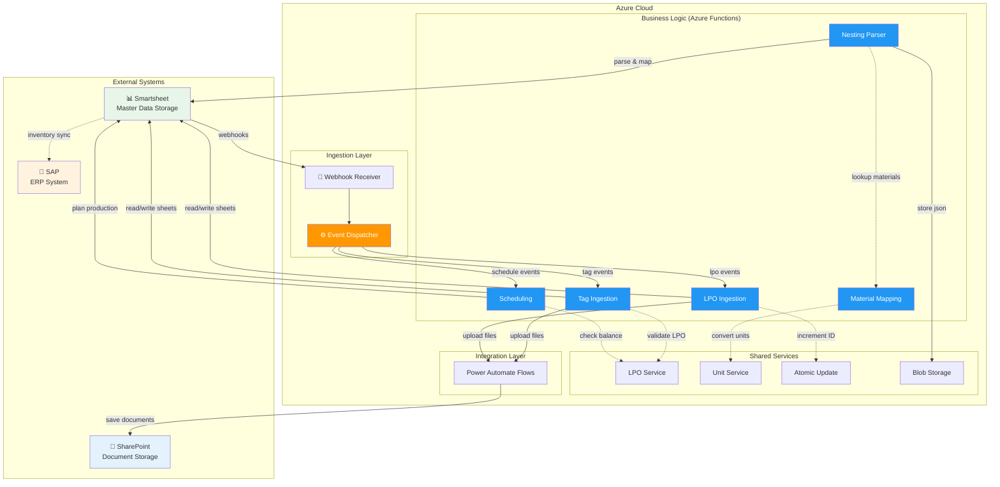
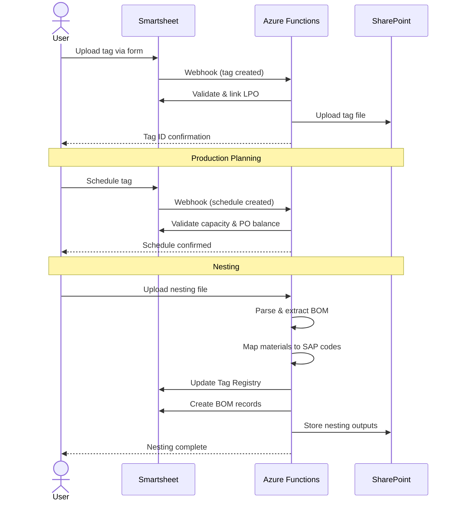

# System Architecture

> **Document Type:** Explanation | **Version:** 1.6.9 | **Last Updated:** 2026-02-06

High-level overview of the Ducts Manufacturing Inventory Management System architecture, components, and data flow.

---

## Component Architecture

---

## Data Flow: Tag to Production

---

## Sheet Inventory

### Master Data (00-01)
- `00 Reference Data` - Static lookup tables
- `00a Config` - System configuration & ID sequences
- `01 LPO Master LOG` - Purchase order records
- `01 LPO Audit LOG` - LPO change history

###Production Flow (02-04)
- `02 Tag Sheet Registry` - Tag records
- `02h Tag Ingestion Staging` - Tag upload queue
- `03 Production Planning` - Shift-level schedules
- `03h Production Planning Staging` - Schedule requests
- `04 Nesting Execution Log` - Nesting sessions

### Material Mapping (05a-06a)
- `05a Material Master` - Canonical material definitions
- `05b Mapping Override` - Customer/project overrides
- `05c LPO Material Brand Map` - LPO-specific mappings
- `05d Mapping History` - Mapping audit trail
- `05e Mapping Exception` - Unresolved materials
- `06a Parsed BOM` - Bill of materials from nesting

### Governance (97-99)
- `97 Override Log` - Approval records
- `98 User Action Log` - Audit trail
- `99 Exception Log` - Exception tracking

---

## Key Design Patterns

### 1. Event-Driven Architecture
- **Pattern**: Smartsheet webhooks → Event Dispatcher → Handler functions
- **Benefit**: Decoupled, scalable processing
- **Implementation**: ID-based routing (`event_routing.json`)

### 2. Ledger-First Data Model
- **Pattern**: Immutable transactions + derived snapshots
- **Benefit**: Full audit trail, time-travel queries
- **Example**: `ALLOCATED_QUANTITY` is sum of allocation log entries

### 3. Idempotency
- **Pattern**: `client_request_id` for all mutations
- **Benefit**: Safe webhook retries, no duplicate records
- **Implementation**: Dedup check before processing

### 4. ID-First Architecture
- **Pattern**: Logical names (code) → Physical IDs (manifest)
- **Benefit**: Rename sheets without code changes
- **Example**: `Sheet.TAG_REGISTRY` → manifest → actual sheet ID

### 5. Centralized Services
- **Pattern**: Shared business logic in `functions/shared/`
- **Benefit**: DRY compliance, consistent behavior
- **Services**: `lpo_service`, `unit_service`, `atomic_update`

---

## Technology Stack

| Layer | Technology | Purpose |
|-------|------------|---------|
| **Compute** | Azure Functions (Python 3.11) | Serverless business logic |
| **Storage** | Smartsheet | Master data & workflow |
| **Documents** | SharePoint | File storage & folders |
| **Orchestration** | Power Automate | Email, file copying |
| **Blob Storage** | Azure Blob Storage | Nesting outputs (v1.6.7) |
| **Monitoring** | Application Insights | Logging & tracing |

---

## Related Documentation

- [API Reference](./reference/api/index.md) - Function endpoints
- [Data Dictionary](./reference/data/index.md) - Sheet schemas
- [Architecture Specification](../Specifications/architecture_specification.md) - Detailed design
