# 🧭 User Journey: Tag Ingestion

> **Document Type:** Tutorial | **Audience:** All Team Members | **Last Updated:** 2026-01-08

This guide walks through the complete user journey for tag ingestion, from form submission to database record creation.

---

## Table of Contents

1. [Overview](#overview)
2. [The Workflow](#the-workflow)
3. [Test Scenarios](#test-scenarios)
4. [Data Fields Reference](#data-fields-reference)
5. [How to Test](#how-to-test)
6. [Verification Steps](#verification-steps)

---

## Overview

The tag ingestion process is the primary entry point for production planning. When a user uploads a tag sheet, the system:

1. Validates the LPO reference
2. Checks for duplicates
3. Generates a unique Tag ID
4. Creates an audit trail
5. Prepares the tag for nesting

### System Flow Diagram

```mermaid
flowchart LR
    A[👤 User Upload] --> B[📊 Smartsheet Form]
    B --> C[⚡ Power Automate]
    C --> D[☁️ Azure Function]
    D --> E{Validation}
    E -->|✅ Valid| F[📝 Tag Created]
    E -->|❌ Invalid| G[🚨 Exception]
    F --> H[📋 User Log]
    G --> H
    H --> I[📤 Response]
```



### Component Responsibility Flow

```mermaid
sequenceDiagram
    participant U as 👤 User
    participant S as 📊 Smartsheet
    participant P as ⚡ Power Automate
    participant F as ☁️ Azure Function
    participant DB as 🗄️ Data Store

    U->>S: Submit Tag Form
    S->>P: Trigger Flow
    P->>P: Generate client_request_id
    P->>F: POST /api/tags/ingest
    F->>F: Validate Request
    F->>DB: Check Idempotency
    F->>DB: Validate LPO
    F->>DB: Generate Tag ID
    F->>DB: Create Tag Record
    F->>DB: Log User Action
    F-->>P: Return Response
    P->>S: Update Row Status
    P-->>U: Notification
```



---

## The Workflow

### Step-by-Step Execution Flow

#### Step 1: Form Submission

User submits the "Tag Upload" form with:

| Field | Example | Required |
|-------|---------|----------|
| LPO Reference | `LPO-2026-001` | Yes |
| Required Date | `2026-02-15` | Yes |
| Area (m²) | `150.5` | Yes |
| Attachment | Tag file (PDF/Excel) | Optional |

#### Step 2: Power Automate Trigger

When a new row is created in Smartsheet:

1. Detects the new row/file
2. Generates a unique `client_request_id` (UUID)
3. Calls the **Azure Function (`fn_ingest_tag`)**

#### Step 3: Azure Function Processing (The "Brain")

```
┌─────────────────────────────────────────────────────────────────┐
│                    fn_ingest_tag Processing                      │
├─────────────────────────────────────────────────────────────────┤
│  1. Authentication                                               │
│     └── Verify API key                                          │
│                                                                  │
│  2. Idempotency Check                                           │
│     └── "Have I seen this client_request_id before?"            │
│     └── If yes: Return cached response (no duplicate created)   │
│                                                                  │
│  3. File Hashing                                                │
│     └── Download file → Compute SHA256 hash                     │
│     └── "Has this EXACT file been uploaded before?"             │
│                                                                  │
│  4. LPO Validation                                              │
│     └── Does the LPO exist in LPO Master?                       │
│     └── Is LPO Status Active? (Not On Hold or Closed)           │
│     └── Is there enough balance? (PO Qty - Delivered >= Area)   │
│                                                                  │
│  5. ID Generation                                               │
│     └── Generate next ID (e.g., TAG-0052)                       │
│     └── Uses centralized sequence counter                       │
│                                                                  │
│  6. User Action Log                                             │
│     └── Records "User X uploaded Tag Y" in audit trail          │
│                                                                  │
│  7. Record Creation                                             │
│     └── Creates row in Tag Sheet Registry (Status: Draft)       │
└─────────────────────────────────────────────────────────────────┘
```

#### Step 4: Response Handling

| Result | Smartsheet Update | Response |
|--------|-------------------|----------|
| ✅ Success | Status: `Uploaded`, Tag ID filled | `200 OK` with tag_id |
| ❌ Failure | Status: `Blocked`, Exception ID | `422/409` with exception_id |

---

## Test Scenarios

### Scenario Matrix

| # | Scenario | Input | HTTP Status | Outcome |
|---|----------|-------|-------------|---------|
| 1 | **Happy Path** | Valid LPO, fresh file, within balance | `200 OK` | Tag created, user action logged |
| 2 | **Duplicate File** | Same file uploaded again | `409 Conflict` | Exception: `DUPLICATE_UPLOAD` |
| 3 | **LPO Not Found** | Invalid/typo in LPO reference | `422 Unprocessable` | Exception: `LPO_NOT_FOUND` |
| 4 | **LPO On Hold** | LPO exists but status is "On Hold" | `422 Unprocessable` | Exception: `LPO_ON_HOLD` |
| 5 | **Insufficient Balance** | Requesting more than available | `422 Unprocessable` | Exception: `INSUFFICIENT_PO_BALANCE` |
| 6 | **System Retry** | Same `client_request_id` sent again | `200 OK` | Returns existing record (idempotent) |

### Detailed Scenario Descriptions

#### Scenario 1: Happy Path ✅

```json
// Request
{
  "lpo_sap_reference": "SAP-ACTIVE-001",
  "required_area_m2": 50,
  "requested_delivery_date": "2026-02-01",
  "uploaded_by": "user@company.com"
}

// Response (200 OK)
{
  "status": "UPLOADED",
  "tag_id": "TAG-0052",
  "trace_id": "trace-abc123"
}
```

**Side Effects:**
- ✅ New row in Tag Sheet Registry
- ✅ Entry in User Action Log
- ✅ `seq_tag` counter incremented

#### Scenario 2: Duplicate File ⚠️

```json
// Response (409 Conflict)
{
  "status": "DUPLICATE",
  "existing_tag_id": "TAG-0050",
  "exception_id": "EX-0101",
  "message": "This file has already been uploaded"
}
```

**Side Effects:**
- ❌ No new tag created
- ✅ Exception record created
- ✅ Entry in User Action Log (failed attempt)

#### Scenario 3: LPO Not Found 🚫

```json
// Response (422 Unprocessable)
{
  "status": "BLOCKED",
  "exception_id": "EX-0102",
  "message": "Referenced LPO not found"
}
```

---

## Data Fields Reference

The function uses these specific columns (defined in `sheet_config.py`):

### LPO Master Sheet (`01 LPO Master LOG`)

| Column | Purpose | Example |
|--------|---------|---------|
| `SAP Reference` | Primary LPO lookup | `SAP-2026-001` |
| `Customer LPO Ref` | Alternate lookup | `CUST-PO-123` |
| `LPO Status` | Validation (Active/On Hold) | `Active` |
| `PO Quantity (Sqm)` | Balance calculation | `500.0` |
| `Delivered Quantity (Sqm)` | Balance calculation | `200.0` |

### Tag Sheet Registry

| Column | Purpose | Example |
|--------|---------|---------|
| `Tag ID` | Generated identifier | `TAG-0052` |
| `File Hash` | Duplicate detection | `sha256:abc123...` |
| `Client Request ID` | Idempotency | `uuid-v4` |
| `Status` | Workflow state | `Draft` |

### Config Sheet (`00a Config`)

| Key | Purpose | Example |
|-----|---------|---------|
| `seq_tag` | ID counter | `51` → `52` |

### Exception Log (`99 Exception Log`)

| Column | Purpose | Example |
|--------|---------|---------|
| `Reason Code` | Error type | `LPO_ON_HOLD` |
| `Severity` | SLA priority | `HIGH` |

---

## How to Test

### A. Manual Testing (via cURL)

You can call the Azure Function directly without Power Automate:

**Endpoint:** `http://localhost:7071/api/tags/ingest` (Local)

#### Happy Path Request

```bash
curl -X POST http://localhost:7071/api/tags/ingest \
  -H "Content-Type: application/json" \
  -d '{
    "client_request_id": "test-run-001",
    "lpo_sap_reference": "YOUR_ACTIVE_LPO_REF",
    "required_area_m2": 50,
    "requested_delivery_date": "2026-02-01",
    "uploaded_by": "tester@example.com"
  }'
```

> **Note:** Omit `file_url` to skip hash check, or use any public URL for testing.

### B. PowerShell Testing

```powershell
$body = @{
    client_request_id = "test-run-$(Get-Date -Format 'yyyyMMddHHmmss')"
    lpo_sap_reference = "YOUR_ACTIVE_LPO_REF"
    required_area_m2 = 50
    requested_delivery_date = "2026-02-01"
    uploaded_by = "tester@example.com"
} | ConvertTo-Json

Invoke-RestMethod -Uri "http://localhost:7071/api/tags/ingest" `
    -Method Post -Body $body -ContentType "application/json"
```

### C. Automated Test Suite

Run the pytest test suite:

```bash
cd functions
pytest -m integration -v
```

This runs:
- Happy path scenarios
- Error handling scenarios
- Idempotency verification
- All acceptance criteria

### D. Specific Test Categories

```bash
# Unit tests only (fast)
pytest -m unit

# Integration tests
pytest -m integration

# Acceptance criteria tests
pytest -m acceptance

# All tests with coverage
pytest --cov=shared --cov=fn_ingest_tag
```

---

## Verification Steps

After running a test, verify in Smartsheet:

### 1. Check Tag Sheet Registry

| Status | What to Look For |
|--------|------------------|
| Success | New row with your Tag ID, Status = "Draft" |
| Failure | No new row created |

### 2. Check Config Sheet (`00a Config`)

| Key | Before | After |
|-----|--------|-------|
| `seq_tag` | `51` | `52` (incremented) |

### 3. Check User Action Log (`98 User Action Log`)

Look for:
- Action Type: `TAG_CREATED` or `OPERATION_FAILED`
- User ID: Your test user
- Notes: Contains trace_id

### 4. Check Exception Log (`99 Exception Log`)

If test was expected to fail:
- New row with Reason Code matching scenario
- Status: `Open`
- SLA Due: Set based on severity

---

## Troubleshooting

| Issue | Possible Cause | Solution |
|-------|---------------|----------|
| No response | Function not running | Run `func start` |
| 401 Unauthorized | Invalid API key | Check `local.settings.json` |
| LPO not found | Wrong reference | Verify LPO exists in Smartsheet |
| No row created | Validation failed | Check response for `exception_id` |

---

## Related Documentation

| Document | Description |
|----------|-------------|
| [API Reference](./reference/api_reference.md) | Complete API docs |
| [Testing Guide](./howto/testing.md) | How to write tests |
| [Troubleshooting](./howto/troubleshooting.md) | Common issues |
| [Tag Ingestion Spec](../Specifications/tag_ingestion_architecture.md) | Detailed architecture |

---

<p align="center">
  <a href="./index.md">📚 Documentation Hub →</a>
</p>
