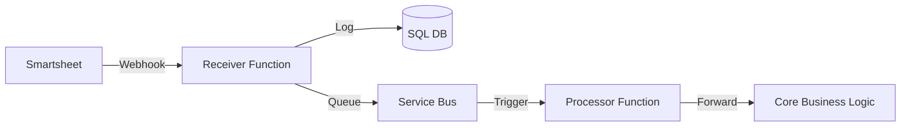

# Smartsheet Webhook Adapter

[](https://azure.microsoft.com/en-us/products/functions/)
[]()

The **Smartsheet Webhook Adapter** is a high-reliability ingestion layer designed to bridge Smartsheet (EU) with our core business automation logic. It solves the limitations of direct integrations by providing **event buffering**, **filtering**, and **guaranteed delivery**.

## 🚀 Key Features

-   **Real-time Ingestion:** Receives webhooks instantly from Smartsheet.
-   **Noise Filtering:** Discards 90% of traffic (cell updates) to focus on `row` and `attachment` events.
-   **Reliability:** Uses **Azure Service Bus** to buffer events during spikes.
-   **Idempotency:** Prevents duplicate processing using a SQL-backed event log.
-   **Zero Business Logic:** Acts purely as a router, keeping the architecture clean.

---

## 📚 Documentation

Detailed documentation is available in the `docs/` directory:

-   **[Architecture](docs/ARCHITECTURE.md):** System design, data flow diagrams, and design principles.
-   **[Configuration](docs/CONFIGURATION.md):** Environment variables, sheet mapping, and manifest details.
-   **[API Reference](docs/API.md):** External webhook endpoints and internal data contracts.
-   **[Operations & Dev](docs/OPERATIONS.md):** Local setup guide, database schema, and troubleshooting.

---

## ⚡ Quick Start

### 1. Prerequisites
-   Python 3.10+
-   Azure Functions Core Tools
-   ODBC Driver 18 for SQL Server

### 2. Setup
```bash
# Clone and install
git clone <repo>
pip install -r requirements.txt

# Configure environment
cp local.settings.json.example local.settings.json
# Edit local.settings.json with your keys
```

### 3. Run
```bash
func start
```

---

## 🏗 System Architecture



## 📝 License
Internal Use Only.