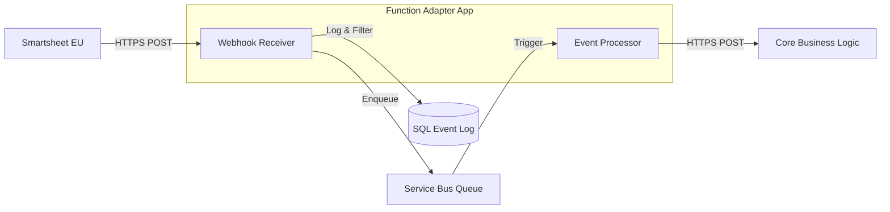

# Architecture Reference

## System Overview

The **Smartsheet Webhook Adapter** serves as an asynchronous, reliable ingestion layer for Smartsheet events. It decouples the source (Smartsheet) from the processing logic (Core Business Functions), ensuring high availability, burst handling, and strict order preservation where necessary.

### High-Level Design

---

## Design Principles

### 1. Zero Business Logic
The adapter is a **dumb pipe**. It does not know *what* an LPO is or how to validate a Tag. Its only responsibility is to:
- **Receive** the event.
- **Ensure** it is valid and from a trusted source.
- **Guarantee** it is delivered to the processing layer at least once.

### 2. Idempotency & De-duplication
Smartsheet webhooks have "at-least-once" delivery semantics. Retries can cause duplicate events.
- **Layer 1 (Database):** Every received event ID is logged to the `event_log` table. If an event ID already exists, it is marked as a duplicate and skipped before queuing.
- **Layer 2 (Service Bus):** The Service Bus queue has duplicate detection enabled (based on Message ID) for a 10-minute window to catch rapid retry bursts.

### 3. Asynchronous Buffering
Directly processing webhooks is risky because Smartsheet expects a response within a few seconds. If processing takes longer, Smartsheet times out and retries, causing loops.
- **Solution:** The Receiver acknowledges the webhook immediately (HTTP 200) after enqueuing it. The heavy lifting happens asynchronously.

---

## Component Details

### 1. `fn_webhook_receiver` (Ingestion)
**Trigger:** HTTP (Anonymous)
**Responsibility:**
1.  **Verification:** Handles the Smartsheet `Smartsheet-Hook-Challenge` handshake.
2.  **Validation:** Checks `Smartsheet-Hmac-SHA256` signature (if configured) or relies on challenge-response.
3.  **Filtering:** Drops irrelevant events (e.g., `sheet.updated`, `cell.created`) based on `webhook_config.py`. Only `row.*` and `attachment.*` events are processed.
4.  **Context Check:** Ensures the event belongs to a known sheet in `workspace_manifest.json`.
5.  **Persistence:** Inserts a record into SQL `event_log` with status `PENDING`.
6.  **Handoff:** Sends the normalized event payload to Azure Service Bus.

### 2. `fn_event_processor` (Router)
**Trigger:** Service Bus (`event-main` queue)
**Responsibility:**
1.  **Retrieval:** Pulls messages from the queue.
2.  **Forwarding:** POSTs the payload to the configured `CORE_FUNCTIONS_BASE_URL`.
3.  **Retry Policy:**
    -   Uses exponential backoff for transient HTTP errors (429, 5xx) from the Core App.
    -   If all retries fail, the message is abandoned, returning to the queue for Service Bus-level redelivery.
    -   After max delivery attempts (default 10), the message moves to the **Dead Letter Queue (DLQ)**.

### 3. `fn_webhook_admin` (Management)
**Trigger:** HTTP (Function Key)
**Responsibility:**
-   **Register:** Programmatically creates webhooks in Smartsheet for all sheets defined in `webhook_config.py`.
-   **List/Audit:** Shows currently active webhooks.
-   **Cleanup:** Removes invalid or stale webhooks.

---

## Data Flow

### Event Lifecycle

1.  **Ingest:**
    -   Payload: `{"webhookId": "...", "events": [...]}`
    -   Action: Parse -> Filter -> DB Insert (`PENDING`) -> Queue.
2.  **Queue:**
    -   Message: `{"event_id": "...", "sheet_id": "...", "row_id": "...", ...}`
    -   Properties: `SessionId` (optional, for ordering), `MessageId` (for de-dupe).
3.  **Process:**
    -   Action: Read -> HTTP POST to Core -> DB Update (`COMPLETED`).
4.  **Error Handling:**
    -   Action: HTTP Fail -> DB Update (`FAILED`) -> DLQ.

---

## Scalability & Limits

-   **Throughput:** Azure Service Bus Standard tier can handle thousands of messages per second.
-   **Concurrency:** Azure Functions scales out the `fn_event_processor` instances based on queue depth.
-   **Database:** `event_log` is indexed for high-speed writes. Old logs should be pruned periodically (e.g., retention policy of 30 days).
