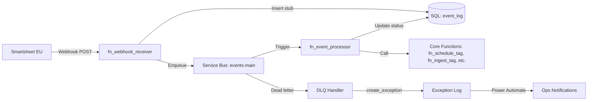
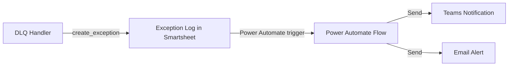

# Webhook Adapter App - Implementation Plan

> **Goal**: Create an Azure Functions-based webhook adapter to replace Power Automate for Smartsheet EU orchestration. The adapter receives Smartsheet webhooks, stores event stubs in SQL, and enqueues messages to Azure Service Bus for processing by Core functions.

---

## Context & Constraints

| Aspect | Details |
|--------|---------|
| **Problem** | Power Automate doesn't support Smartsheet EU region (`api.smartsheet.eu`) |
| **Solution** | Custom webhook adapter app running on Azure Functions |
| **Architecture** | Adapter (fast) → Service Bus Queue → Core Worker (heavy processing) |
| **Region** | Smartsheet EU: `https://api.smartsheet.eu/2.0` |

---

## Proposed Architecture



---

## Proposed Changes

### New: Webhook Adapter Functions

#### [NEW] `fn_webhook_receiver/__init__.py`
HTTP-triggered function for webhook callbacks.

**Responsibilities:**
1. Handle Smartsheet verification challenge (echo `Smartsheet-Hook-Challenge` header)
2. Parse incoming event callbacks
3. Generate stable `event_id` from webhook data
4. Check idempotency (SQL `event_log`)
5. Insert stub with status `PENDING`
6. Enqueue to Service Bus with `messageId` = `event_id`
7. Return 200 OK immediately

**Route:** `POST /api/webhook/smartsheet`

```python
# Verification handshake
challenge = req.headers.get('Smartsheet-Hook-Challenge')
if challenge:
    return Response(
        status=200,
        headers={'Smartsheet-Hook-Response': challenge},
        body={'smartsheetHookResponse': challenge}
    )
```

---

#### [NEW] `fn_event_processor/__init__.py`
Service Bus-triggered function for processing events.

**Responsibilities:**
1. Receive message from `events-main` queue
2. Determine event type and route to appropriate handler:
   - `row.UPDATE on PRODUCTION_PLANNING` → Process scheduling changes
   - `row.UPDATE on TAG_REGISTRY` → Process tag status changes
   - `attachment.ADD on TAG_REGISTRY` → Fetch attachment, call parser
3. Update `event_log.status` to `SUCCESS` or `FAILED`
4. Call existing Core functions as needed

---

#### [NEW] `fn_webhook_admin/__init__.py`
Admin endpoints for webhook management.

**Endpoints:**
- `POST /api/webhooks/register` - Create webhook via Smartsheet API
- `GET /api/webhooks` - List active webhooks
- `DELETE /api/webhooks/{id}` - Delete webhook
- `POST /api/webhooks/refresh` - Re-validate all webhooks

> **Note:** No authentication layer implemented - admin access controlled via deployment/network level.

---

#### [NEW] `fn_dlq_handler/__init__.py`
Timer-triggered function for DLQ processing.

**Responsibilities:**
1. Read messages from `events-main/$DeadLetterQueue`
2. Call `create_exception()` with severity `CRITICAL`
3. Power Automate flow (triggered by exception creation) handles stakeholder notifications
4. Provide mechanism for manual reprocessing

**Schedule:** Every 5 minutes

---

### New: Shared Modules

#### [NEW] `shared/service_bus.py`
Service Bus producer with retry logic.

```python
def send_event(event: dict, queue: str = "events-main") -> bool:
    """Send event to Service Bus with messageId for deduplication."""
    message = ServiceBusMessage(
        body=json.dumps(event),
        message_id=event["event_id"],
        correlation_id=event["trace_id"],
        content_type="application/json"
    )
    # ... send with retry
```

---

#### [NEW] `shared/event_log.py`
SQL event_log operations.

```python
def insert_event_stub(event_id, source, sheet_id, row_id, payload, trace_id) -> bool
def update_event_status(event_id, status, processed_at=None) -> bool
def event_exists(event_id) -> bool
```

---

### Database Schema (Azure SQL)

#### [NEW] `event_log` table

```sql
CREATE TABLE event_log (
    event_id VARCHAR(100) PRIMARY KEY,
    source VARCHAR(50) NOT NULL DEFAULT 'SMARTSHEET',
    sheet_id VARCHAR(50),
    row_id VARCHAR(50),
    object_type VARCHAR(50),      -- row, attachment, cell, comment
    action VARCHAR(20),           -- ADD, UPDATE, DELETE
    received_at DATETIME2 NOT NULL DEFAULT SYSUTCDATETIME(),
    processed_at DATETIME2 NULL,
    status VARCHAR(20) NOT NULL DEFAULT 'PENDING',
    attempt_count INT NOT NULL DEFAULT 0,
    payload NVARCHAR(MAX) NULL,
    trace_id UNIQUEIDENTIFIER NULL,
    error_message NVARCHAR(MAX) NULL
);

CREATE INDEX IX_event_log_status ON event_log(status);
CREATE INDEX IX_event_log_sheet_row ON event_log(sheet_id, row_id);
CREATE INDEX IX_event_log_received_at ON event_log(received_at);
```

---

### Configuration

#### [MODIFY] `local.settings.json`
Add new configuration:

```json
{
  "Values": {
    "SERVICE_BUS_CONNECTION": "@Microsoft.KeyVault(SecretUri=...)",
    "SQL_CONNECTION_STRING": "@Microsoft.KeyVault(SecretUri=...)",
    "WEBHOOK_CALLBACK_URL": "https://<app>.azurewebsites.net/api/webhook/smartsheet",
    "SYSTEM_ACTOR_EMAILS": "automation@ducts.ae,system@ducts.ae",
    "WATCHED_SHEETS": "PRODUCTION_PLANNING,TAG_REGISTRY,LPO_MASTER"
  }
}
```

---

## Event Routing Matrix

| Sheet | Event | Action | Handler |
|-------|-------|--------|---------|
| `PRODUCTION_PLANNING` | row.UPDATE | Call `fn_schedule_tag` or update status | `process_schedule_event` |
| `TAG_REGISTRY` | row.ADD | Validate and create tag | `process_tag_event` |
| `TAG_REGISTRY` | attachment.ADD | Fetch file, call parser | `process_attachment_event` |
| `LPO_MASTER` | row.UPDATE | Validate LPO changes | `process_lpo_event` |
| `EXCEPTION_LOG` | row.UPDATE | Check if resolved | `process_exception_event` |

---

## Notification Flow



> **Design Decision:** All stakeholder notifications flow through Power Automate via exception creation. This keeps the adapter focused on event processing while leveraging Power Automate's notification capabilities.

---

## Implementation Phases

### Phase 1: Core Infrastructure (Week 1)
- [ ] Create SQL `event_log` table
- [ ] Create Azure Service Bus namespace and queue
- [ ] Implement `fn_webhook_receiver` with verification
- [ ] Implement `shared/service_bus.py` producer
- [ ] Implement `shared/event_log.py` SQL operations
- [ ] Test webhook creation and verification locally

### Phase 2: Event Processing (Week 2)
- [ ] Implement `fn_event_processor` with routing
- [ ] Add handlers for TAG_REGISTRY events
- [ ] Add handlers for PRODUCTION_PLANNING events
- [ ] Implement attachment download and storage
- [ ] Test end-to-end flow locally

### Phase 3: Admin & Monitoring (Week 3)
- [ ] Implement `fn_webhook_admin` endpoints
- [ ] Implement `fn_dlq_handler`
- [ ] Add App Insights telemetry
- [ ] Create Power Automate flow for exception notifications
- [ ] Deploy to Azure (staging)

### Phase 4: Production Rollout (Week 4)
- [ ] Register webhooks for all watched sheets
- [ ] Validate with live traffic
- [ ] Document runbooks
- [ ] Go live

---

## Verification Plan

### Local Testing
```bash
# Start functions locally
func start

# Simulate verification challenge
curl -X POST http://localhost:7071/api/webhook/smartsheet \
  -H "Smartsheet-Hook-Challenge: test-challenge-123" \
  -d '{"challenge": "test-challenge-123"}'

# Simulate event callback
curl -X POST http://localhost:7071/api/webhook/smartsheet \
  -d '{"webhookId": 123, "events": [{"objectType": "row", "action": "UPDATE"}]}'
```

### Acceptance Criteria
1. Verification challenge → Correct response with echo header
2. Event callback → Row inserted in `event_log`, message in Service Bus
3. Duplicate callback → Idempotent (no new enqueue)
4. System actor update → Ignored (NOOP status)
5. DLQ item → Exception created in Smartsheet, Power Automate sends notification

---

## Files Summary

| Action | Path | Purpose |
|--------|------|---------|
| NEW | `fn_webhook_receiver/__init__.py` | Receive Smartsheet webhooks |
| NEW | `fn_webhook_receiver/function.json` | Route: POST /api/webhook/smartsheet |
| NEW | `fn_event_processor/__init__.py` | Process events from Service Bus |
| NEW | `fn_event_processor/function.json` | Service Bus trigger |
| NEW | `fn_webhook_admin/__init__.py` | Admin endpoints for webhook management |
| NEW | `fn_dlq_handler/__init__.py` | DLQ processing |
| NEW | `shared/service_bus.py` | Service Bus client |
| NEW | `shared/event_log.py` | SQL event_log operations |
| MODIFY | `requirements.txt` | Add azure-servicebus, pyodbc |
| NEW | `migrations/001_create_event_log.sql` | Database migration |

---

## Dependencies

```txt
# Add to requirements.txt
azure-servicebus>=7.0.0
pyodbc>=5.0.0
```

---

## Security Considerations

1. **Webhook Callback**: No auth required (Smartsheet verification via challenge)
2. **Admin Endpoints**: Access controlled at network/deployment level
3. **Smartsheet API Token**: Stored in Key Vault, accessed via managed identity
4. **Service Bus**: Connection string in Key Vault
5. **SQL**: Connection string in Key Vault, managed identity preferred

---

## Observability

- **Trace ID**: Generated per request, propagated to all downstream calls
- **Structured Logging**: JSON format with `{trace_id, event_id, sheet_id, action, status}`
- **App Insights Metrics**:
  - `webhook.received` - Count of webhooks received
  - `webhook.enqueued` - Count successfully enqueued
  - `webhook.duplicate` - Count of duplicates
  - `event.processed` - Count processed by Core
  - `dlq.count` - Dead letter queue depth
