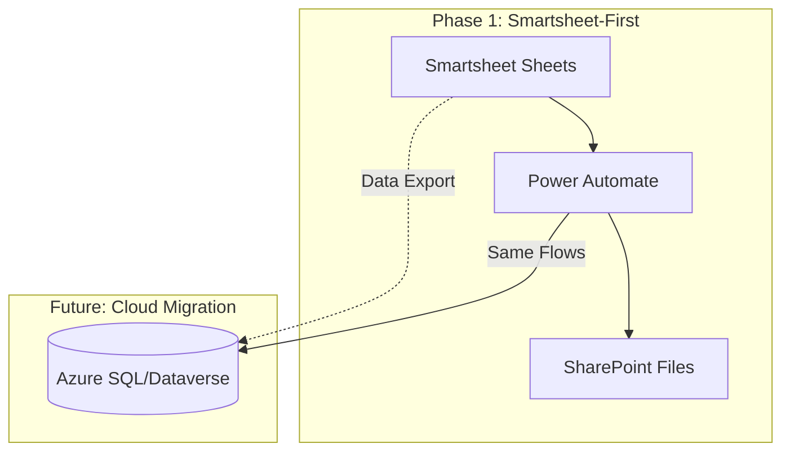
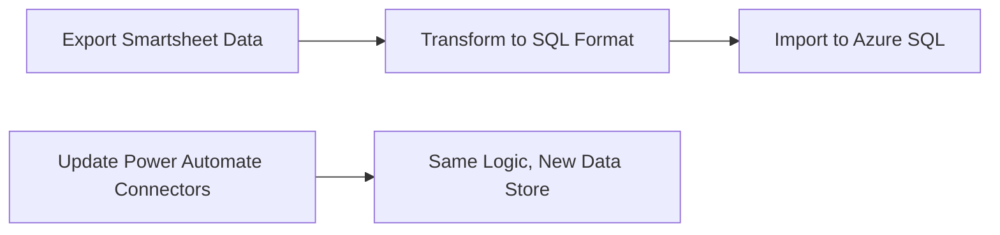

# Manufacturing Inventory Management System - Implementation Plan

## Overview

Build a **Smartsheet-first, migration-ready** manufacturing inventory system with:
- **Ledger-first design** using Smartsheet sheets as tables
- **Canonical data contracts** matching target Azure SQL/Dataverse schema
- **Power Automate orchestration** for all business logic
- **One-click migration path** - only data push needed, no reconfiguration

---

## Design Principles

### Migration-Ready Architecture

| Principle | Implementation |
|-----------|----------------|
| **Canonical Column Names** | Use exact field names from spec (e.g., `tag_id`, `lpo_id`, `txn_type`) |
| **Immutable Transactions** | Append-only rows in transaction sheets |
| **No Smartsheet Formulas** | All logic in Power Automate (portable) |
| **SHA256 Hashing** | File deduplication ready for any storage |
| **JSON for Complex Fields** | `DO_lines`, `approvals` stored as JSON strings |

---

## Smartsheet Schema (Migration-Ready)

### Master Sheets

| Sheet | Maps To | Key Columns |
|-------|---------|-------------|
| `LPO_Log` | `lpo_log` | lpo_id, customer_lpo_ref, sap_reference, po_quantity, delivered_quantity, status |
| `Config` | `config` | config_key, config_value, effective_from, changed_by |

### Planning Sheets

| Sheet | Maps To | Key Columns |
|-------|---------|-------------|
| `Tag_Sheet` | `tag_sheet` | tag_id, lpo_id, required_area_m2, status, file_hash, created_at |
| `Cut_Session` | `cut_session` | cut_session_id, tag_id, file_hash, expected_consumption, parser_version |
| `Production_Log` | `production_log` | prod_id, cut_session_id, part_id, area, dimensions |

### Inventory Sheets

| Sheet | Maps To | Key Columns |
|-------|---------|-------------|
| `Allocation` | `allocation` | allocation_id, tag_id, material_code, qty, shift, status, reserved_until |
| `Inventory_Txn` | `inventory_txn` | txn_id, txn_type, material_code, qty, ref_id, created_at |
| `Inventory_Snapshot` | `inventory_snapshot` | snapshot_date, material_code, sap_qty, system_qty, physical_qty, variance |

### Fulfillment Sheets

| Sheet | Maps To | Key Columns |
|-------|---------|-------------|
| `Delivery_Order` | `delivery_order` | do_id, tag_id, sap_do_number, status, do_lines_json |
| `Remnant_Log` | `remnant_log` | remnant_id, dimensions, area, status, created_at, consumed_at |

### Governance Sheets

| Sheet | Maps To | Key Columns |
|-------|---------|-------------|
| `Exception_Log` | `exception_log` | exception_id, exception_type, severity, assigned_to, status, resolution |
| `User_Action_History` | `user_action_history` | action_id, user_id, action_type, target_table, old_value, new_value |

---

## Discovery Phase: Analyze Existing Sheets

Before implementation, I will:
1. **Pull workspace metadata** via Smartsheet API
2. **Map existing columns** to canonical schema
3. **Identify gaps** (missing columns, naming mismatches)
4. **Create migration matrix** showing current → target mapping

---

## Power Automate Flows

| Flow | Trigger | Logic Location |
|------|---------|----------------|
| `Tag_Ingest` | Smartsheet form | All in Power Automate (portable) |
| `Nesting_Parse` | SharePoint upload | Power Automate + HTTP action |
| `Allocate` | Cut session status change | Power Automate |
| `Exception_Alert` | Exception sheet row add | Power Automate adaptive card |

---

## Migration Path (Future)

When ready to migrate:

**No changes needed to:**
- Business logic (in Power Automate)
- Column names / data contracts
- File storage (SharePoint)
- User workflows

---

## Next Steps

1. **Receive Smartsheet API credentials**
2. **Pull workspace metadata**
3. **Analyze existing structure vs specification**
4. **Create gap analysis report**
5. **Begin Sprint 0 implementation**
